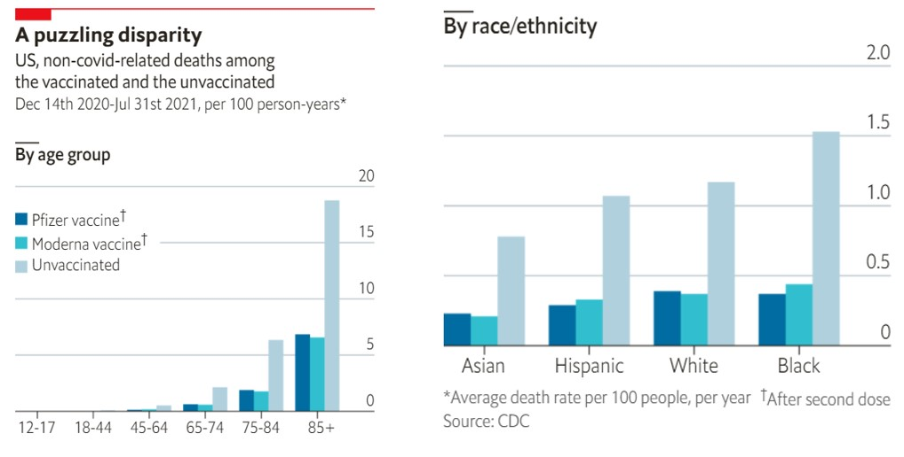

<style>
.column-left{
  float: left;
  width: 60%;
  text-align: left;
}
.column-right{
  float: right;
  width: 40%;
  text-align: right;
  padding-left: 10px;
}

.column-full{
  float: none;
  width: 100%;
  text-align: left;
}


.column-right-text-left{
  float: right;
  width: 40%;
  text-align: left;
  font-size: 10px;
}


.column-right-text-center{
  float: right;
  width: 40%;
  text-align: center;
  font-size: 16px;
}

.RUsers {
  padding: 1em;
  background: aliceblue;
  color: black;
}


.SPSS {
  padding: 1em;
  background: whitesmoke;
  color: black;
}

</style>


```{r setup, include=FALSE}
knitr::opts_chunk$set(echo=FALSE,
                      message=FALSE,
                      warning=FALSE)
library(tidyverse)
library(kableExtra)

```

# Lab 1: Introduction to R and RMarkdown

Welcome to your first lab report specification! 


::: { .SPSS }

*Notice* 

Below you will find the numeric analysis. Kindly submit both assignments, combined in one final report. 

:::


<div class="column-right-text-left">
<!-- </div> -->
```{r fig.margin = TRUE, fig.cap = "Video Guide on Perusall", fig.align="right", out.width=250}
knitr::include_graphics("images/vguide.png")
```

To learn more about different types of variables, please watch [this short video](https://www.youtube.com/watch?v=7bsNWq2A5gI).

</div>

* A step by step video with instructions on how to do this lab is available on [Perusall](https://app.perusall.com/courses/grl-2a-statistics-i/orgs-lab-1a-377619530?assignmentId=xd9T78P38HY7noXh7&part=1).
* Please submit your lab using [this link](https://docs.google.com/forms/d/e/1FAIpQLScTCQ-fnSp952ahYedG3ivZmP0BeeraFJW6iYXSD1mKo26sZQ/viewform).  
* Would you like to use one of your tokens for an extension or an upgrade from $R \rightarrow M$ ? Please fill in [this form](https://bit.ly/3Lx6Xo4).  
* If you have questions, please [book a slot](https://bit.ly/OferMeet) during Ofer's office hours!

This document defines  the specifications you need to meet in your report. You will create a project in RStudio, which will consist of a folder with your various resources: write your report in `rmarkdown`, and zip the entire folder by the deadline. The output format and other meta-information can be  specified in the YAML, at the beginning of your R Markdown document, as follows:

```yaml
---
title: "Report for lab 1"
author: "Groucho Marx"
date: "Submitted 15-November-2021"
output:
  html_document
---
```

### Exercise 1: Introduce yourself  using RMarkdown

<div style= "float:right;position: relative; margin-left: 10px">

```{r fig.margin = TRUE, fig.cap = "Ofer with nieces in the mountains of Jerusalem", fig.align="right", out.width=300}

```
</div>

Take a picture of yourself, your cat or something else that is personal to you. Then Write a little introduction about your relationship with statistics. Did you ever study it or thought of studying it? Do you have any background in statistics? Do you think learning it may benefit you in the future? 


Do you reckon that you will remember anything from the course in a year's time? How about two years time? Or more? You can use this introduction in order to show-off the skills that you've learned. For example, you could experiment with:

* The use of [nested
lists](https://commonmark.org/help/tutorial/10-nestedLists.html)
* [A link](https://www.youtube.com/watch?v=DNS7i2m4sB0) to web-pages about
anything you feel could be relevant
* Doing cool stuff with fonts, such as
  - Using *italic font* to emphasize really important ideas!
  - Using  **bold** fonts. 
  - If you are especially bold, try adding a little image of yourselves (doing
  something silly, like singing in the mountains.)
  

::: { .RUsers }

*Specifications exercise 1:* 

For this exercise, you need to submit a text introducing yourself and making use of some of the features of `RMarkdown`. Add a picture of yourself if possible, make sure that your picture appears nicely in the knitted report. 

:::


### Exercise 2: Manually presenting tables with data

<div style= "float:right;position: relative; margin-left: 10px">
```{r fig.margin = TRUE, fig.cap = "Variable types",  out.width=300}
knitr::include_graphics("images/Variables.png")
```
</div>


In this exercise, you are going to find **your own dataset**, and copy it manually, into your report. Try to find an interesting dataset, and mention where you found it (source). 
It is important that the variables are numerical, and that
they are associated with one another somehow. Once you identify a dataset that you like,
you will format it in a way that markdown would render as a table.

```{r food-short, echo=TRUE}

# Create a variable for your data
# The first line creates the variable 'food.data' 
# The second defines the names of the columns
# The rest are entries in the dataset - one row per observation.

food.data <- tribble(
    ~item,         ~grams, ~calories, ~carbs, 
    "Apricots",     250,     220,       57,
    "Grapefruit",   250,     170,       44,
    "skimmed milk", 250,     128,       13,
    "Orange Juice", 250,     112,       25
)
  

```

And, after adding a couple of rows, you can see the result below. Notice that in this particular table, every row (food item) is an object of observation (or unit of analysis), whereas the columns designate variables (aka covariate, feature or property of the object). 

```{r hidden-food,include=FALSE}
food.data <- tibble(
  item=c("Apricots","Grapefruit","skimmed milk","Orange juice",
  "chicken soup","Tapioca pudding","Spanish rice","Grape juice",
  "Apple juice","Grapefruit juice","Spaghetti with sauce"), 
  grams=rep(250,11), 
  calories=c(220,170,128,112,75,335,217,160,125,100,285), 
  carbs=c(57,44,13,25,10,42,40,42,34,24,35))

```


```{r table2, echo=TRUE, fig.cap="Nutrients", fig.width=350}

kable_classic(kbl(food.data), full_width = FALSE,position="left")

```


Finally, we can create a scatter plot as follows:

```{r scatter, echo=TRUE, fig.height=3, fig.width=5}
qplot(x=carbs, y=calories, data=food.data)

```

Now you can analyse what you found in a couple of sentences. For example, from the scatterplot above you can see that the calories are roughly proportional to the carbs in the food. All the items of food have a mass of 250g, so they are comparable in that sense. However, they may vary in the amount of fat they contain or in their protein. That's why we see certain items that have a lower rate of carb despite having much calories. An example is the  "Tapioca pudding" which clearly has just above 40g of carbs and yet tops the charts when it comes to calories... 


::: { .RUsers }


*Specifications exercise 2:* 


For this exercise, you need to *describe* the data set you found, and its source/origin. You will need to create a table with the data and a scatter plot that is based on your data. 


Notice that in a scatter-plot, both the `x-axis` and the `y-axis` **must** refer to [continuous variables](https://www.youtube.com/watch?v=cz4nPSA9rlc). So you can use grams and calories, or age and height, or weight and height, because all of these are continuous variables. However, you cannot use country and flag, or personal ID and bank-account, or gender and language, because all of these are [categorical variables](https://www.youtube.com/watch?v=7bsNWq2A5gI).

:::


### Exercise 3: using mathematical notation in RMarkdown

In this exercise we will want to use [mathematical
notation](https://rpruim.github.io/s341/S19/from-class/MathinRmd.html) in
RMarkdown. You will choose a mathematical sequence, and see if you can calculate whether
the sum of the series really matches what the formula says it would. For
example, you could try one of [these
series](https://en.wikipedia.org/wiki/List_of_mathematical_series), say - let's
take the following:

$$\sum_{k=1}^{m}k^2=\frac{m^3}{3}+ \frac{m^2}{2}+\frac{m}{6}$$
$$\sum_{k=1}^{10}k^2=\frac{10^3}{3}+ \frac{10^2}{2}+\frac{10}{6} $$
$$\sum_{k=1}^{10}k^2=1^2+2^2+3^2+...+10^2 $$

So now we need to take a vector of numbers, square each one of them and add them up together. 
Here are different ways of doing this. For example we could just say

```{r summation, echo=TRUE}

# This first line creates a vector of numbers from 1, 2, 3... 10
series <- 1:10  

# This second line squares the numbers, so that we get 1, 4, 9... 100
series.squared <- series^2  

# Finally, we add all the squares and assign it to the variable 'sum.series.squared'
sum.series.squared <- sum(series.squared)

```

So now we get that the `sum.series.squared=` `r sum.series.squared`. On the other hand, if we look at the formula above and assign the variable `m=10`, we get 

```{r formula, echo=TRUE}
m <- 10
result <- m^3/3+m^2/2+m/6

```

And we find that the `result=` `r result`. So we have confirmed this result. 
Feel free to experiment with something more challenging, like using the [Fibonacci sequence](https://en.wikipedia.org/wiki/Fibonacci_number) to arrive at the golden ratio, or finda series that converges to some interesting value such as the Leibniz formula for $\pi$.


::: { .RUsers }


*Specifications exercise 3:* 

Here you need to identify a sequence that has a formula. Please *avoid* using the formula given in the example. Instead, find a different formula. For example, you could use this formula: 

$1^3 + 2^3 + 3^3 +···+ n^3 = (1 + 2 + 3 +···+ n)^2$

Which can also be written as... 

$$\sum_{k=1}^{n}k^3= \left( \sum_{k=1}^{n}k \right)^2 $$


You will then calculate the sum of the sequence in two different ways: first directly, by adding up the numbers and second by calculating the formula. Finally, you will compare both calculations and show that you reached the same result.

:::


<div style= "float:right;position: relative; margin-left: 10px">

```{r fig.margin = TRUE, fig.cap = "DO's and DONT'S in lab reports", fig.align="right", out.width=450}

```
</div>
### `r emo::ji("heavy_check_mark")` DO
* Make sure your submission consists of a self-contained zip-file with a
RMarkdown file and all necessary resources to knit it smoothly
* Include a knitted pdf or an html file with your report
* Present a report that looks professional, neat and tidy
* Upload a zip file with *your* name on it (first and last name)
* All the R- Code is contained within code-chunks


### `r emo:: ji("cross_mark")` DO NOT
* DO NOT show irrelevant code, data, messages or warnings in your report
* Where possible, avoid hard coding numbers into your
text. Instead, calculations are made 'on the fly'


<br/>
<br/>
<br/>
<br/>


# Numeric literacy: Covid and non-covid related death

Please study the graph below carefully, read the explanation and answer the questions below: 


<!-- <div class="column-full"> -->
<!-- </div> -->
```{r numeric-lit ,fig.cap = "US, non-covid-related deaths among the vaccinated and the unvaccinated Dec 2020-Jul 2021", fig.align="center", out.width=800}

```


<!-- </div> -->


It was over a year ago that Pfizer and BioNTech announced the first promising results from a clinical trial of a covid-19 vaccine. Now [a recent report](https://bit.ly/3oEFfvQ) from the Centres for Disease Control (CDC) in America has produced a novel, and even mysterious, reason to be glad for a covid-19 vaccination. The CDC data show that people vaccinated with the Pfizer or Moderna covid-19 jabs are *one-third* as likely to die of other causes too.


The result is bewildering, all the more so for its scale. The CDC’s study started with the health records of more than 11m Americans, showing that, after removing deaths associated with covid-19, and removing the influence of  demographic factors such as age and sex, people who had been jabbed were far likelier to have survived. Those who had been double-jabbed with either Pfizer or Moderna vaccines had an average non-covid-related mortality rate of roughly 0.35 per 100 person-years (meaning that between three and four people would be expected to die out of 1,000 monitored for a year.) 

For the unvaccinated, the mortality rate was *more than three* times as high. The pattern held across all races and ethnicities, and in most of the age groups, even as overall mortality rates changed.

### Questions: 

1. What do you notice?
    
    After studying the graph and reading the text, what details do you see in the graph that are unusual or surprising? Looking at it carefully and paying attention to detail, what can you get out of the graph that is not necessarily obvious at first glance
    
2. What do you wonder? 
    
    Try to formulate a question, related to the graph, something that you would genuinely like to know. Please state your question clearly: as in a statement that ends with a question mark. 
    
3. How does this relate to you and your community?

    Think of something that makes this graph relate to you personally or to your community, however defined. Make sure that you *do not* talk about something that relates the graph to everyone, no matter who they are, but only to members of *your* community, something *specific* that does not related to other communities.  
    
4. BONUS: What’s going on in this graph? Create a catchy headline that captures the graph’s main idea.


