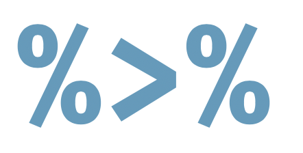

<style>
.column-left{
  float: left;
  width: 60%;
  text-align: left;
}
.column-right{
  float: right;
  width: 40%;
  text-align: right;
  padding-left: 10px;
}

.column-full{
  float: none;
  width: 100%;
  text-align: left;
}


.column-right-text-left{
  float: right;
  width: 40%;
  text-align: left;
  font-size: 10px;
}


.column-right-text-center{
  float: right;
  width: 40%;
  text-align: center;
  font-size: 16px;
}

.RUsers {
  padding: 1em;
  background: aliceblue;
  color: black;
}


.SPSS {
  padding: 1em;
  background: whitesmoke;
  color: black;
}

</style>


```{r setup, include=FALSE}
knitr::opts_chunk$set(echo=FALSE,
                      message=FALSE,
                      warning=FALSE)
library(tidyverse)
library(kableExtra)
library(datasauRus)

```


::: { .SPSS }

*Notice* 

Below the lab section you will find the numeric analysis assignment. Kindly submit *both* assignments, either in one final report or separately. 

:::


<div class="column-right-text-left">
<!-- </div> -->
```{r fig.margin = TRUE, fig.cap = "Video Guide on Perusall", fig.align="right", out.width=250}
knitr::include_graphics("images/vguide.png")
```


</div>

* To jump-start your lab, please download the zip file from here. [TBD]
* A step by step video with instructions on how to do this lab [is available](https://app.perusall.com/courses/grl-2a-statistics-i/orgs-lab-2a?assignmentId=pC5mbRCxgWRxmmiAk&part=1) on Perusall.
* Please submit your lab using a link that will be available here [TBD].  
* Would you like to use one of your tokens for an extension or an upgrade from $R \rightarrow M$ ? Please fill in [this form](https://bit.ly/3Lx6Xo4).
* If you have questions, please [book a slot](https://bit.ly/OferMeet) during Ofer's office hours!


<!-- * Feel free to use the [template zip file](https://github.com/OferEngel/SO/raw/origin/backup/Lab%2002/MY-NAME-HERE-Lab-02.zip) to jump start your report. -->
<!-- * Please submit your lab using [this link](https://docs.google.com/forms/d/e/1FAIpQLScEBz8qHNwtUR21zEwgpJm2o3vuv5YQ2Xjqbas1YMIKS5xY3A/viewform)   -->


In this Exercise, we are going to explore different data-sets. The datasets appear very different in scatter-plots, but they have a lot in common as well. The original Datasaurus (`dino`) was created by Alberto Cairo in [this great blog post](http://www.thefunctionalart.com/2016/08/download-datasaurus-never-trust-summary.html). The other Dozen were generated using simulated annealing and the process is described in the paper *Same Stats, Different Graphs: Generating Datasets with Varied Appearance and Identical Statistics* through Simulated Annealing by Justin Matejka and George Fitzmaurice. In the paper, the authors simulate a variety of datasets that share the same summary statistics with the Datasaurus (correlations, means etc...) but have very different distributions.


<div style= "float:right;position: relative; margin-left: 20px">
```{r dino, echo=FALSE, fig.align="right", out.width=300}
knitr::include_graphics("images/dinosaur.png")
```
</div>

If it is the first time you are using these packages, you  will need to install the packages in your console using `install.packages("name-of-package")`. Then you need to load them in a code-chunk within your R Markdown (Rmd) document and see the results.
If you’d like to run parts of your code in the Console, you’ll also need to load the packages there. To do so, run the following in the console:

```{r load-lib, eval = FALSE, echo=TRUE}
library(tidyverse) 
library(datasauRus)
library(kableExtra)
```


### Interlude: The pipe operator

{width=150}

The **pipe operator**, which **is percent greater than percent**, tells `R` to pass the object that comes before it into the first argument of the function that comes after it. Mathematically, **x pipe f(y)** becomes *f(x, y)*, since x is piped into the first argument of the function f().

{width=200}

For example, one way of adding numbers in R is using the `sum()` function. The `sum()` function has as many arguments as there are numbers you wish to add, where each number is separated with a comma. For example, to add 3 and 4, we would use the following code. Notice, 3 and 4 are separated by a comma, indicating that these are the two numbers we wish for the `sum()` function to add. 

```{r sumdata1, echo=TRUE, eval=FALSE}
# Sum of 3 and 4, without pipe
sum(3, 4)
```

If we wanted to do the same operation with a pipe, we would instead use the
code below. The pipe operator inserts 3 as the first argument into the `sum()`
function, which looks like `sum(3, 4)`. 

```{r sumdata2, echo=TRUE, eval=FALSE}
# Sum of 3 and 4, with pipe
3 %>% sum(4)
```

Piping the number  $3$ into the function `sum()`  may seem a bit silly, especially since it's  not much easier than typing `sum(3,4)`. However, as we progress through these tutorials you will see that the piping operator will allow us to sequentially link together data wrangling operations. This can save us a great deal of headache later on, as the format of operations that use the pipe are far simpler to read! We'll start with short pipes and throughout the tutorial build up to longer pipes that perform multiple operations.


##  The `datasauRus` package


The data frame we will be working with today is called `datasaurus_dozen` and it is in the `datasauRus` package. Actually, this single data frame contains 13 datasets, all lumped together. Each of the datasets has a different name, and the names are listed in the column `dataset`. To find out more about the `datasaurus_dozen`, type the following in your Console: `?datasaurus_dozen`. A question mark before the name of an object will always bring up its help file. This command must be ran in the Console.

1. Based on the help file, how many rows and how many columns does the `datasaurus_dozen` file have? What are the variables included in the data frame? Now observe various summary statistics of each data-set (see explanation below). What do you notice? Add your responses to your lab report.

To see the names of the different datasets, you can use the `table` command - try typing this in the console: 

```{r list-datsets, eval=FALSE, echo=TRUE}
# These commands will list the names of the different datasets
# Don't forget to load the library in the console!
library(tidyverse) 
library(datasauRus)

# The distinct functions extracts unique values from a column
datasaurus_dozen %>% distinct(dataset) 

```

Notice the pipe operator: `%>%`, takes what comes before it and sends it as the first argument to what comes after it. So in this case, the `datasaurus_dozen %>% distinct(dataset)` would be the same as `distinct(datasaurus_dozen, dataset)`.


Let's now choose one of those datasets and make a plot and calculate some summary statistics. Please feel free to choose a different 

```{r bullseye, eval=FALSE, echo=TRUE}

# First, I will extract only the `bullseye` dataset
bullseye <- datasaurus_dozen %>% filter(dataset=="bullseye") 

# How many rows and columns does our dataset have? 
dim(bullseye)

# Now, I will make my plot 
qplot(x,y, data=bullseye)

# Finally, I will calculate summary statistics
bullseye %>% summarise(mean.x=mean(x), mean.y=mean(y), 
                       cor.xy=cor(x,y),
                       sd.x=sd(x), sd.y=sd(y), 
                       sample.size=n())

```

2. Choose four different datasets from `datasaurus_dozen`, and create a plot for each of the four datasets. 

3. Create a table with summary statistics for each of the four datasets. You will have a row for each dataset, and a column for each summary statistics, consisting of the means of x and y, the standard deviations of x and y, the correlation between x and y and the sample size. To create the table - you can use the code below and adapt it!

```{r food-summary.stats, echo=TRUE, eval=FALSE}

# Create a variable for your data 
# The first line creates the variable 'summary.stats' 
# The second defines the names of the columns
# The rest are entries in the dataset - one row per observation.
# Make sure to replace the `NA` with the real numbers!

summary.stats <- tribble(
    ~dataset,    ~mean.x, ~mean.y, ~sd.x, 
    "v_lines",   NA,       NA,        NA,
    "h_lines",   NA,       NA,        NA,
    "x_shape",   NA,       NA,        NA,
    "stars",     NA,       NA,        NA
)
  
kbl(summary.stats)

```


```{marginfigure}
Matejka, Justin, and George Fitzmaurice. "Same stats, different graphs: Generating datasets with varied appearance and identical statistics through simulated annealing." Proceedings of the 2017 CHI Conference on Human Factors in Computing Systems. ACM, 2017.
```

 

Finally, we want to visualize ALL the datasets. This time, we will use the `ggplot` function for this. Its first argument is the entire data you're visualizing. Next we define the `aes`thetic mappings. In other words, the columns of the data that get mapped to certain aesthetic features of the plot, e.g. the `x` axis will represent the variable called `x` and the `y` axis will represent the variable called `y`. Then, we add another layer to this plot where we define which `geom`etric shapes we want to use to represent each observation in the data. In this case we want these to be points,m hence `geom_point`. Notice that we could do the same with `qplot`, but `ggplot` has more functions that we will be using further down the line. 

```{r fig.fullwidth=TRUE, eval=FALSE}
ggplot(data = dino_data, mapping = aes(x = x, y = y)) +
  geom_point()
```

For the next part of this exercises, we need to calculate a summary statistic: the correlation coefficient. Correlation coefficient, often referred to as `r` in statistics, measures the linear association between two variables. If `r` is positive we expect a positive correlation between the two variables. 

When  will see that some of the pairs of variables we plot do not have a linear relationship between them. This is exactly why we want to visualize first: visualize to assess the form of the relationship, and calculate `r` only if relevant. In this case, calculating a correlation coefficient really doesn't make sense since the relationship between `x` and `y` is definitely not linear -- it's dinosaurial!

But, for illustrative purposes, let's calculate correlation coefficient between `x` and `y`.

```{marginfigure}
Start with `dino_data` and calculate a summary statistic that we will call `r` as the `cor`relation between `x` and `y`. 

```


```{marginfigure}
Facet by the dataset variable, placing the plots in a 3 column grid, and don't add a legend.
```

4. Now we will plot the `y` vs. `x` for all the datasets contained in `datasaurus_dozen` using facets. Facet iterates through the dataset variable, placing the plots in a 3 column grid. Make sure to configure the size of the diagram by adding options in your code-chunk  using the cog-wheel.

```{r all-viz, echo=TRUE, eval=FALSE, fig.fullwidth=TRUE}
ggplot(datasaurus_dozen, aes(x = x, y = y, color = dataset))+
  geom_point()+
  facet_wrap(~ dataset, ncol = 3) +
  theme(legend.position = "none")
```


5. Finally: use the [DrawMyData tool](http://robertgrantstats.co.uk/drawmydata.html), to create your own drawing. From this drawing you can extract the dataset. Plot the dataset using `ggplot` and calculate the correlation as before.   


<br/>
<br/>
<br/>
<br/>


# Numeric literacy: International Optimism

What do people think, by country, about whether the world is becoming a better or worse place with each generation? Who is more optimistic — young adults or adults?

Please study the graph below carefully, read the explanation and answer the questions below: 


<!-- <div class="column-full"> -->
<!-- </div> -->
```{r numeric-lit ,fig.cap = "Is the world is becoming a better or worse place with each generation? ", fig.align="center", out.width=800}
knitr::include_graphics("images/wgitg-optimism.png")
```


<!-- </div> -->

This graph shows how young adults, ages 15 to 24 years old, and adults, ages 40 or older, responded to the question: “Do you think the world is becoming a better or worse place with each generation?” The data is from a survey of more than 21,000 people from 21 countries who are part of nationally representative samples from all regions of the world.

### Questions: 

1. What do you notice?

::: { .RUsers}
In your answers, you may like to explore the following: When noticing the survey responses of the 15- to 24-year olds (youth) as compared to the 40+ year olds (parents) for each of the 21 countries, which countries are in each of the following three categories and how would you characterize the countries in each category?
  
*   The youth and parents have a similar level of optimism
*   The youth have more optimism than their parents
*   The parents have more optimism than the youth
What do countries in each group have in common, if anything?
  
  In addition: The difference in responses given by the youth and the parents is measured by the vertical distance a country’s point is from the **y = x**-line (see Stat Nuggets below). Which countries have the largest divergence? Why do you think each of these countries has this large divergence?

Which countries have the largest divergence? Why do you think each of these countries has this large divergence?

:::
    
2. What do you wonder? 

::: { .RUsers}

  Try to formulate a question, related to the graph, something that you would genuinely like to know. Please state your question clearly: as in a statement that ends with a question mark. 

:::
    
3. How does this relate to you and your community?

::: { .RUsers}

  Think of something that makes this graph relate to you personally or to your community, however defined. Make sure that you *do not* talk about something that relates the graph to everyone, no matter who they are, but only to members of *your* community, something *specific* that does not relate to other communities.  
  
::: 
    
4. What’s going on in this graph? Create a catchy headline that captures the graph’s main idea.


<br/>
<br/>
<br/>
<br/>

## Stat - nuggets: 

Below, we define mathematical and statistical terms and how they relate to this graph. 

### SCATTER PLOT

A scatter plot is a graph that is used to display the relationship between two quantitative variables and is described by the direction, strength and form of the relationship, and unusual observations.

  * *Direction*: A positive direction means that the y-variable tends to increase as the x-variable increases (or an uphill trend). A negative direction means that the y-variable tends to decrease as the x-variable increases (or a downhill trend). Relationships between quantitative variables are said to have no direction when there is no consistent positive or negative pattern in the scatter plot.

  * *Strength*: The relationship between two quantitative variables runs from strong, if the points fall in a “tight” pattern, to weak, if they are spread out.

  * *Form*: The form of a relationship is determined by the pattern of the points in the scatter plot. The most common forms are linear and curved. If there is no apparent pattern in the scatter plot, the form is sometimes referred to as scattered.

  * *Outliers*: Unusual points that do not fit the general pattern in the scatter plot are called outliers.

::: { .RUsers}

In the International Optimism graph, the quantitative variables are the percentage of youth and the percentage of parents who responded “Yes” to the survey question “Will the next generation do better than the one that came before?” There are two statistics shown for each of the 21 countries surveyed: the percentage of 40+ year olds who think the world is getting better, which is shown on the x-axis and the percentage of 15- to 24 year olds who think the world is getting better, which is shown on the y-axis. The direction of the relationship is positive. The strength is moderately strong. The form is somewhat linear. There are no unusual countries, though the United States and Japan have the largest difference in opinion between youth and parents.
:::


  * *Y = X LINE* The y = x line is formed by all ordered pairs in which the x-value equals the y-value, such as (0,0), (0.7, 0.7), (13.4, 13.4), etc.
  
::: { .RUsers}

  In the International Optimism graph, The y = x line is a solid line from (0%, 0%) to (100%, 100%). The points on this line show all possible responses for which the same percentage of 40+ year olds and 15- to 24-year olds think the world is getting better.
::: 

  * *STRATIFIED RANDOM SAMPLE*: A sample is a group of individuals selected from the population of interest. A random sample is representative of the population because its members are selected randomly in a way such that all members of the population are equally likely to be selected. However, even well-designed random samples may still be biased, meaning the statistic obtained from the sample may not accurately estimate the true value that would be obtained from the population if the entire population were surveyed. Bias arises for multiple reasons, one of which is undercoverage: where some segments of the population may be under-represented in the sample. To address this possible problem, the population may be divided into strata by characteristics, such as gender or location, and a random sample is selected from each of the strata. In addition, the results of the stratified random samples may be weighted so that the characteristics of the samples are in the same proportion as the characteristics of the entire population.


::: { .RUsers}

In the International Optimism graph, the sample was obtained using a stratified sample design which involved randomly selecting individuals from each of 21 different countries. Depending on the country, each country was stratified by either geographic regions, telephone carriers and/or demographic characteristics. From each country’s strata, a random sample of 15- to 24-year olds and 40+ year olds were interviewed on either landlines or mobile devices. By including users of both landlines and mobile devices, this method reduced some of the bias caused by the differences in age and income distribution of users of landlines or mobile devices. The sample data was then weighted by age, gender, education, race/ethnicity and other factors to minimize over- and under-representing these characteristics. From this weighted data, the statistics for the population of interest were calculated.

::: 