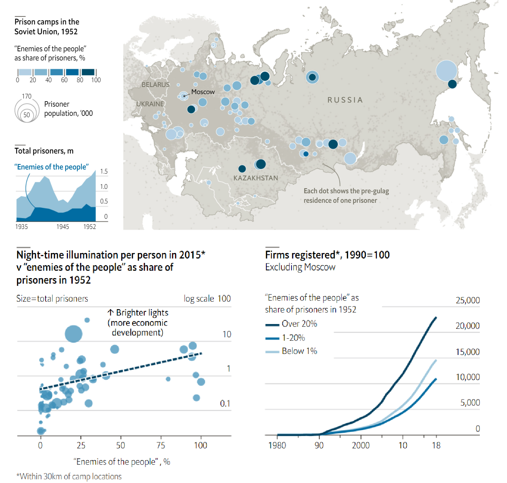

<style>
.column-left{
  float: left;
  width: 60%;
  text-align: left;
}
.column-right{
  float: right;
  width: 40%;
  text-align: right;
  padding-left: 10px;
}

.column-full{
  float: none;
  width: 100%;
  text-align: left;
}


.column-right-text-left{
  float: right;
  width: 40%;
  text-align: left;
  font-size: 10px;
}


.column-right-text-center{
  float: right;
  width: 40%;
  text-align: center;
  font-size: 16px;
}

.RUsers {
  padding: 1em;
  background: aliceblue;
  color: black;
}


.SPSS {
  padding: 1em;
  background: whitesmoke;
  color: black;
}

</style>


```{r setup, include=FALSE}
knitr::opts_chunk$set(echo=FALSE,
                      message=FALSE,
                      warning=FALSE, 
                      eval = TRUE)
library(tidyverse)
library(kableExtra)

```


::: { .SPSS }

*Notice* 

Below the lab section you will find the numeric analysis assignment. Kindly submit *both* assignments, either in one final report or separately. 

:::


<div class="column-right-text-left">
<!-- </div> -->
```{r fig.margin = TRUE, fig.cap = "Alfred Nobel", fig.align="right", out.width=250}
knitr::include_graphics("images/nobel.jpg")
```


</div>

<!-- * A step by step video with instructions on how to do this lab [is available](https://app.perusall.com/courses/grl-2a-statistics-i/orgs-lab-2a?assignmentId=pC5mbRCxgWRxmmiAk&part=1) on Perusall. -->
* Please submit your lab using [this link](https://docs.google.com/forms/d/e/1FAIpQLSfcpbe4S3SMUCY7SMLU-tAcobF6XbawKpDjpGYDa6PVlYZn1w/viewform).  
* Would you like to use one of your tokens for an extension or an upgrade from $R \rightarrow M$ ? Please fill in [this form](https://bit.ly/3Lx6Xo4).
* If you have questions, please [book a slot](https://bit.ly/OferMeet) during Ofer's office hours!


<br/>
<br/>


In January 2017, Buzzfeed published [an article](https://www.buzzfeednews.com/article/peteraldhous/immigration-and-science) on the contribution of immigrants to science in America. The article  shows that while most living Nobel laureates in the sciences are based in the US, many of them were born in other countries. This is one reason why scientific leaders say that immigration is vital for progress.

In this lab we will work with the data from this article to recreate some of their visualizations as well as explore new questions.

### Lab prep

You have one task to complete before the lab:

-   **Task :** Read the Buzzfeed article titled [*These Nobel Prize Winners Show Why Immigration Is So Important For American Science*](https://www.buzzfeednews.com/article/peteraldhous/immigration-and-science)*.* We will replicate this analysis in the workshop so it's crucial that you're familiar with it ahead of time.


Before we introduce the data, let's warm up with some simple exercises.

-   Update the YAML, changing the author name to your name, and **knit** the document.
- We'll use the **tidyverse** package for much of the data wrangling. Make sure you load it by adding it to your setup - code chunk. Then run it in your Console as well:

```{r load-packages, message = FALSE}
library(tidyverse)
```

### Data

The dataset for this assignment can be found as a CSV (comma separated values) file in the `data` folder of your repository.
You can read it in using the following command:

```{r load-data, message = FALSE, echo=TRUE}
nobel <- read.csv("https://bit.ly/3Ikf3i0")
```

The variable descriptions are as follows:

-   `id`: ID number
-   `firstname`: First name of laureate
-   `surname`: Surname
-   `year`: Year prize won
-   `category`: Category of prize
-   `affiliation`: Affiliation of laureate
-   `city`: City of laureate in prize year
-   `country`: Country of laureate in prize year
-   `born_date`: Birth date of laureate
-   `died_date`: Death date of laureate
-   `gender`: Gender of laureate
-   `born_city`: City where laureate was born
-   `born_country`: Country where laureate was born
-   `born_country_code`: Code of country where laureate was born
-   `died_city`: City where laureate died
-   `died_country`: Country where laureate died
-   `died_country_code`: Code of country where laureate died
-   `overall_motivation`: Overall motivation for recognition
-   `share`: Number of other winners award is shared with
-   `motivation`: Motivation for recognition

In a few cases the name of the city/country changed after laureate was given (e.g. in 1975 Bosnia and Herzegovina was called the Socialist Federative Republic of Yugoslavia).
In these cases the variables below reflect a different name than their counterparts without the suffix \`\_original\`.

-   `born_country_original`: Original country where laureate was born
-   `born_city_original`: Original city where laureate was born
-   `died_country_original`: Original country where laureate died
-   `died_city_original`: Original city where laureate died
-   `city_original`: Original city where laureate lived at the time of winning the award
-   `country_original`: Original country where laureate lived at the time of winning the award


### Get to know your data

1.  How many observations and how many variables are in the dataset? Use [inline code](https://rmarkdown.rstudio.com/lesson-4.html) to answer this question. What does each row represent?


There are some observations in this dataset that we will exclude from our analysis to match the Buzzfeed results.

2.  Create a new data frame called `nobel_living` that filters for

-   laureates for whom `country` is available
-   laureates who are people as opposed to organizations (organizations are denoted with `"org"` as their `gender`)
-   laureates who are still alive (their `died_date` is `NA`)

```{r echo=FALSE}
nobel_living <- nobel %>%
  filter(
    !is.na(country),
    gender != "org",
    is.na(died_date)
  )
```

Confirm that once you have filtered for these characteristics you are left with a data frame with `r nrow(nobel_living)` observations, once again using inline code.

🧶 *Knit frequently, knit often. Look at your report, make sure it looks neat, professional and tidy.*

### Most living Nobel laureates were based in the US when they won their prizes

... says the Buzzfeed article.
Let's see if that's true.

First, we'll create a new variable to identify whether the laureate was in the US when they won their prize.
We'll use the `mutate()` function for this.
The following pipeline mutates the `nobel_living` data frame by adding a new variable called `country_us`.
We use an if statement to create this variable.
The first argument in the `if_else()` function we're using to write this if statement is the condition we're testing for.
If `country` is equal to `"USA"`, we set `country_us` to `"USA"`.
If not, we set the `country_us` to `"Other"`.

::: { .SPSS}
Note that we can achieve the same result using the `fct_other()` function  (i.e. with `country_us = fct_other(country, "USA")`). We decided to use the `if_else()` here to show you one example of an if statement in R.
:::

```{r}
nobel_living <- nobel_living %>%
  mutate(
    country_us = if_else(country == "USA", "USA", "Other")
  )
```

Next, we will limit our analysis to only the following categories: Physics, Medicine, Chemistry, and Economics.

```{r}
nobel_living_science <- nobel_living %>%
  filter(category %in% c("Physics", "Medicine", "Chemistry", "Economics"))
```

For the next exercise work with the `nobel_living_science` data frame you created above.
This means you'll need to define this data frame in your R Markdown document, even though the next exercise doesn't explicitly ask you to do so.

3.  Create a faceted bar plot visualizing the relationship between the category of prize and whether the laureate was in the US when they won the nobel prize.
    Interpret your visualization, and say a few words about whether the Buzzfeed headline is supported by the data.

    -   Your visualization should be faceted by category.
    -   For each facet you should have two bars, one for winners in the US and one for Other.
    -   Flip the coordinates so the bars are horizontal, not vertical.

🧶 *Knit frequently, knit often. Look at your report, make sure it looks neat, professional and tidy.*

### But of those US-based Nobel laureates, many were born in other countries

::: { .SPSS}
**Hint:** You should be able to ~~cheat~~ borrow from code you used earlier to create the `country_us` variable.
:::

4.  Create a new variable called `born_country_us` that has the value `"USA"` if the laureate is born in the US, and `"Other"` otherwise.
    How many of the winners are born in the US?

5.  Add a second variable to your visualization from Exercise 3 based on whether the laureate was born in the US or not.
    Based on your visualization, do the data appear to support Buzzfeed's claim?
    Explain your reasoning in 1-2 sentences.

    -   Your final visualization should contain a facet for each category.
    -   Within each facet, there should be a bar for whether the laureate won the award in the US or not.
    -   Each bar should have segments for whether the laureate was born in the US or not.

<br/>
<br/>


### Here's where those immigrant Nobelists were born

::: { .SPSS}
Note that your bar plot won't exactly match the one from the Buzzfeed article. This is likely because the data has been updated since the article was published.
:::

<br/>


6.  In a single pipeline, filter for laureates who won their prize in the US, but were born outside of the US, and then create a frequency table (with the `count()` function) for their birth country (`born_country`) and arrange the resulting data frame in descending order of number of observations for each country. Which country is the most common?


Now go back through your write up to make sure you've answered all questions and all of your R chunks are properly labelled. Each chunk must have a different label, or else you will get an error and won't be able to knit. 

Once you decide that you're done with this lab, knit the R Markdown document one last time to confirm that they you can reproduce the report.

<br/>

### Interested in how Buzzfeed made their visualizations?

The plots in the Buzzfeed article are called waffle plots.
You can find the code used for making these plots in Buzzfeed's GitHub repo (yes, they have one!) [here](https://buzzfeednews.github.io/2017-01-immigration-and-science/).
You're not expected to recreate them as part of your assignment, but you're welcomed to do so for fun!


<br/>
<br/>
<br/>

# Numeric literacy: Levelling up at gunpoint

Educated political prisoners settled near their jails and passed on their human capital to their children.

Please study the graph below carefully, read the explanation and answer the questions below: 


<!-- <div class="column-full"> -->
<!-- </div> -->
```{r numeric-lit ,fig.cap = "Levelling up at gunpoint", fig.align="center", out.width=800}

```


"The bedbugs infested the board bunks like locusts...in autumn the typhus arrived...We crawled to the fence and begged: ‘Give us medicine.’ And the guards fired a volley from the watchtowers." In "The Gulag Archipelago" [Alexander Solzhenitsyn](https://en.wikipedia.org/wiki/Aleksandr_Solzhenitsyn) chronicled the soul-crushing torment of Soviet prisoners. Jailed for criticising the government, Solzhenitsyn was one of the 2.65m people in 1921-59 arrested for "counter-revolutionary activities" and labelled “enemies of the people” (eotp).

Not all eotp were dissidents: simply belonging to the petite bourgeoisie often led to a trip to the gulag. As a result, eotp tended to be well-educated. In 1939, 1% of census respondents and 2% of gulag inmates had university degrees. Among eotp in 1927-53, the rate was 15%. Incarcerating eotp thus entailed relocating much of the Soviet intelligentsia. And a [new paper](https://voxeu.org/article/enemies-people) by Gerhard Toews of the New Economic School in Moscow and Pierre-Louis Vézina of King’s College London shows that regions where eotp were jailed still reap economic benefits from this forced migration.

Next, the paper measured current levels of economic development within 30km of prison sites. It found that the greater a camp’s share of eotp in 1952, the richer and better-educated people living nearby are today—even after accounting for regional differences and factors that affected where eotp were sent. A ten-percentage-point increase in the share of inmates who were eotp corresponded to gains of 8% in wages; 23% in profits per worker; 23 percentage points in the share of firms at which the average worker went to university; and 21% in the strength of light emitted at night per person, a measure of economic output. After the Soviet Union broke up, the number of registered firms also grew unusually fast near former camps with lots of eotp.


### Questions: 

1. What do you notice?
    
    After studying the graph and reading the text, what details do you see in the graph that are unusual or surprising? Looking at it carefully and paying attention to detail, what can you get out of the graph that is not necessarily obvious at first glance
    
2. What do you wonder? 
    
    Try to formulate a question, related to the graph, something that you would genuinely like to know. Please state your question clearly: as in a statement that ends with a question mark. 
    
3. How does this relate to you and your community?

    Think of something that makes this graph relate to you personally or to your community, however defined. Make sure that you *do not* talk about something that relates the graph to everyone, no matter who they are, but only to members of *your* community, something *specific* that does not related to other communities. This is your opportunity to be creative!  
    
4. What’s going on in this graph? Write a catchy headline that captures the graph’s main idea.
