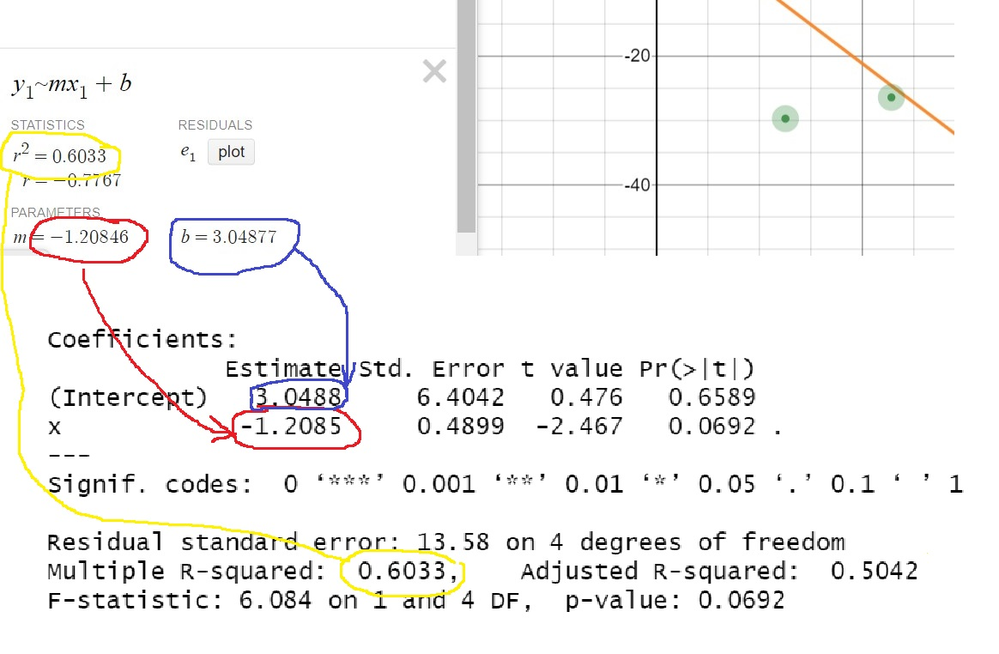
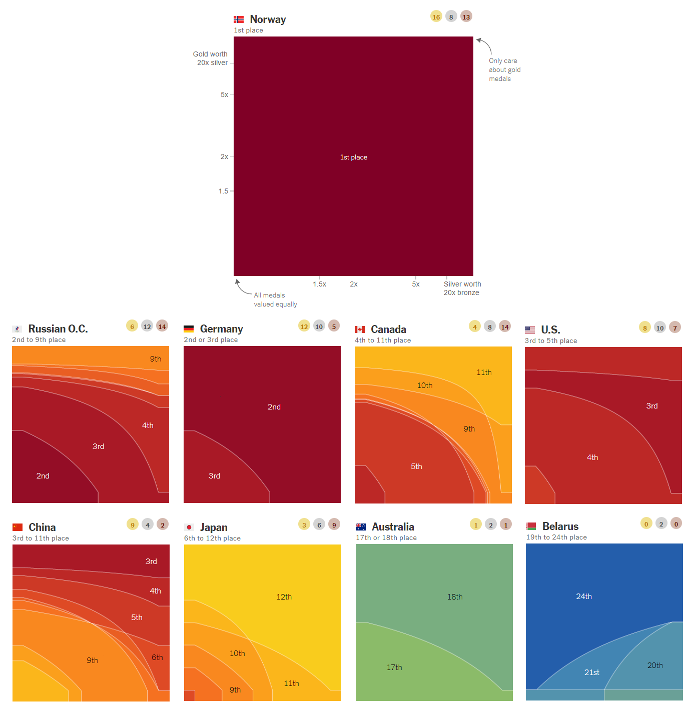

<div style= "float:right;position: relative; margin-left: 100px">
<!-- </div> -->
```{r bday, echo=FALSE, fig.align="right", out.width=150}

```
</div>

```{r setup, include=FALSE}
knitr::opts_chunk$set(echo = TRUE)
library(tidyverse)
library(broom)
library(modelsummary)
library(kableExtra)

# Load penguins data
penguins <- read_csv("data/penguins.csv")

```

This week we are going to venture into the wonderful world of regression analysis. The first task you will start off with a model, and then create fake data that would fit to that model. In the second part, you will explore a dataset about Penguins. 


As usual, you have the following resources available to you:

* A step by step video with instructions on how to do this lab will be available on Perusall.
* A template for this lab is available [here](https://github.com/OferEngel/statistics/raw/master/backup/Lab%2004%20Penguins/MY-NAME-HERE-Lab%2004.zip) to jump start your report.
* Please submit your lab using [this link](https://docs.google.com/forms/d/e/1FAIpQLScnUi56_TA24O4s9zR3v_6gIo_3QZG9ty6F0zl8PnVEAC8ppA/viewform).
* If you have questions, please [book a slot](https://bit.ly/OferMeet) during Ofer's office hours!


### Task 1: A dataset for a friend's birthday!

As researchers, you will first have to acquire a data-set, and only then you will fit it with a linear regression. Why do you need the regression? In order to understand the *mechanisms* that generated your data. 

In this exercise, we are going to do everything the other way around. We are going to start with a linear equation model, and then generate a data-set, such that our model would be the best fit for that data-set. 

The first thing you want to do is to choose two numbers: 

* one number for the slope of the linear equation (a positive number between 0.50 and 4 or a negative one between -4 and -0.50) 
* one number for the intercept (any number between -4 and 4) 

The numbers should be meaningful to you in some way. They can be someone's birthday, but they can be something different. For example, I have a special friend whose birthday is the 3 of December. So I will choose an intercept of 3 (I could also choose 0.30), and a slope of -1.2 (since December is 12th month, and I wanted a number between -4 and 4, I decided to take 1.2 and make it negative just for fun). The next step would be to create a diagram of my linear model. (I could also choose the slope to be 3 and the intercept to be 1.2 if I want, whatever choice I make is fine, as long as I stay within the constraints described above).

1. Please choose *two* numbers as indicated above. Explain why you chose them and, using one of them as the slope and the other as an intercept, plot the linear equation in your report. 


```{r linear-eq.show, eval=FALSE}

ggplot() + geom_abline(intercept=3, slope=-1.2, color="red") + 
  # The following lines are just for the x-axis and the y-axis 
  geom_hline(yintercept = 0, color="grey")+ geom_vline(xintercept = 0, color="grey") +
  # The following tells R about the names of the axes and their limits. 
  scale_x_continuous(name="x-axis", limits=c(-5,5)) +
  scale_y_continuous(name="y-axis", limits=c(-5,5)) 

```


```{r linear-eq, fig.height=3, fig.width=3, echo=FALSE}

ggplot() + geom_abline(intercept=3, slope=-1.2, color="red") + 
  # The following lines are just for the x-axis and the y-axis 
  geom_hline(yintercept = 0, color="grey")+ geom_vline(xintercept = 0, color="grey") +
  # The following tells R about the names of the axes and their limits. 
  scale_x_continuous(name="x-axis", limits=c(-5,5), breaks=-5:5) +
  scale_y_continuous(name="y-axis", limits=c(-5,5), breaks=-5:5) 

```

<div style= "float:right;position: relative; margin-left: 10px">
```{r Desmos01, echo=FALSE, fig.align="right", out.width=240}

```
</div>

Finally, we are going to use the [desmos platform](https://www.desmos.com/calculator), in order to create our dataset. What you want to do is to click on the hamburger on the top left side of the screen, choose the linear regression tool and open it. You will see six green dots on the graph, each dot is a data point whose $x$ and $y$ coordinates are visible in the table on the left part of the screen. You can now click-and-drag the green dots and move them around, changing the coordinates of the data point. When you move the dot, you can see that the regression line will move  accordingly, minimizing its distance to the data points (more precisely, minimizing the square of the residuals). Now try to move the dots, such, that you will have a line with the intercept and slope you've chosen in question 1. I got the picture below. Notice that the data can be fit with a model that has the slope and the intercept I've chosen before. Also, notice the value of $R^2$   


<div style= "float:right;position: relative; margin-left: 100px">
<!-- </div> -->
```{r Desmos03, echo=FALSE, fig.align="right", out.width=300}
knitr::include_graphics("images/Desmos03.png")
```
</div>


Below you can see how I run the linear regression model...
```{r my.dataset.show, eval=FALSE}

df <- tribble(
  ~x,~y,
  0.1,	4.6,
  -11,	19.7,
  -0.2,	-2,
  22.8,	-26.3,
  12.5,	-29.6,
  15.1,	4.4,
) 

df %>% kbl(align="c") 

mdl <- lm(y~x,data=df)
summary(mdl)

```

<div style= "float:right;position: relative; margin-left: 100px">
```{r Desmos06, echo=FALSE, fig.align="right", out.width=300}

```
</div>
The command `lm(y~x,data=df)` calculates the slope and intercept of the model, the test-statistics, their p-values, the $R^2$ and related information. When you write the formula `y~x`, you are telling R that $y$ is the outcome (dependent) variable and $x$ is the explanatory (independent variable). 

Below you can compare the results I got in R to the results I got on the [desmos platform](https://www.desmos.com/calculator). You can see that I got very similar results. Hooray! 

2. Now copy the data you created into your RMarkdown and present it in a neat table, one column for your x variable and one for your y variable. 
    
    * Create a scatter-plot with the points and the regression line, and then run a regression model for your data. Compare the results (the slope, intercept and the $R^2$) to the results shown in the [desmos platform](https://www.desmos.com/calculator).

3. Try now to create a dataset that can be fit with the exact same model (i.e, with the same  *slope* and *intercept*), but this time  try to choose the data in such a way that the $R^2$ would be dramatically different (e.g. 50% larger or 50% smaller, than the one you had in the previous model). Now present a neat table with your data points and run the regression model in R. Confirm that your slope, intercept and $R^2$ are what you expected them to be.

<div style= "float:right;position: relative; margin-left: 20px">
```{r penguins, echo=FALSE, fig.align="right", out.width=300}
knitr::include_graphics("images/penguins.png")
```
</div>


🧶 *Knit frequently, knit often. Look at your report, make sure it looks neat, professional and tidy.*

### Task 2: Penguins

In the previous task we started with a model (slope and intercept), and created data to match. In this exercise, just like in real life, we do things the other way around. We start with the data. Between 2007 and 2009, researchers collected data on penguins in three islands in the Palmer Archipelago in Antarctica: Biscoe, Dream, and Torgersen. The `penguins` dataset has data for 342 penguins from 3 different species: Chinstrap, Gentoo, and Adélie. It includes the following variables:

- `species`: The penguin's species (Chinstrap, Gentoo, and Adélie)
- `island`: The island where the penguin lives (Biscoe, Dream, and Torgersen)
- `bill_length_mm`: The length of the penguin's bill, in millimeters (distance from the penguin's face to the tip of the bill)
- `bill_depth_mm`: The depth of the penguin's bill, in millimeters (height of the bill; distance from the bottom of the bill to the top of the bill)
- `flipper_length_mm`: The length of the penguin's flippers, in millimeters
- `body_mass_g`: The weight of the penguin, in grams
- `sex`: The sex of the penguin
- `year`: The year the observation was made

The first thing we need to do is to load our dataset.


```{r load-penguins, eval=FALSE}
# Load penguins data
penguins <- read_csv(_______________)
```


#### Exploratory analysis

<div style= "float:right;position: relative; margin-left: 20px">
```{r islands, echo=FALSE, fig.align="right", out.width=250}
knitr::include_graphics("images/peng-islands.png")
```
</div>

Let's say we want to know  the relationship between penguin weight and bill depth. Start with a simple plot like the one below:

```{r plot-penguin-weight-depth, eval=FALSE}
ggplot(data = penguins, 
       aes(x = bill_depth_mm, y = body_mass_g)) +
  geom_______

```

Notice that each point in the graph is associated with a penguin, and for each penguin we have information about its different features: weight, bill depth, flipper length etc...


4. Make a new plot that colors these points by species. What can you tell about the relationship between bill depth and penguin weight? 


```{r plot-penguin-weight-depth-by-species, echo=FALSE}
ggplot(data = penguins, 
       aes(x = bill_depth_mm, y = body_mass_g, color=species)) +
  geom_point() + 
  scale_x_continuous(name="bill depth (mm)", breaks=seq(13,21,by=1)) + 
  scale_y_continuous(name="body mass (g)")

```

5. Now make a new graph that depicts the  the relationship between flipper length and body mass, such that `flipper_length_mm` on the x-axis, `body_mass_g` on the y-axis, and points colored by `species`. Facet the plot by island (you can do that by adding another layer, namely `+ facet_grid(island~.)`). Finally, tell a story about the relationship between flipper length and weight in these three penguin species, and the distribution of penguins across the three islands.


```{r eval=FALSE}
ggplot(data = penguins,
       aes(x = _______, y = ________, color = ___________)) +
  geom___________ +
  facet_grid(island~.)
```


```{r include=FALSE}
ggplot(data = penguins,
        aes(x = flipper_length_mm, y = body_mass_g, color = species)) +
     geom_point() +
    facet_grid(island~.) + theme(legend.position = "bottom")

```

🧶 *Knit frequently, knit often. Look at your report, make sure it looks neat, professional and tidy.*


#### Models: Does bill depth predict penguin weight?

6. Run a regression model and interpret the regression coefficients. Is the association between your variables statistically significant? Is the slope of your regression positive or negative? What does that mean? How well does your model predict the body weight? (Hint: look at the $R^2$). 

```{r model-depth-weight, include=FALSE}
model_depth_weight <- lm(body_mass_g ~ bill_depth_mm,
                         data = penguins)

summary(model_depth_weight)


```


7. Now look at each type of penguin separately, and fit a separate model for each. Compare between the models you have constructed. In your answer, explain the following: 

    * The models in this question have a slope with a different sign compared to the model in the previous question. Try to explain why that is. 
    * The $R^2$ of the models in this question are greater than those of the model in the previous question. Try to explain what that means and why that is.  

🧶 *Knit frequently, knit often. Look at your report, make sure it looks neat, professional and tidy.*

<br/>
<br/>
<br/>


# Numeric literacy: What nations "won" the 2022 Beijing Winter Olympics?

What is the best way to rank countries competing in the Olympics based on the medals they won?

One way to answer this question is by counting how many medals each country won, and then assigning a value to each gold, silver and bronze medal. Norway won whether we value all medals equally or value silver medals higher than bronze ones, and gold medals higher than silver ones. If all medals are valued equally, the United States came in fifth, but if we value silver medals higher than bronze ones, and gold medals higher than silver ones, then the U.S. came in fourth. Which countries "win" varies on how the medals are valued.

The graphs above show only 9 of the 27 countries which won medals. Look closely at the x- and y-axes to help you interpret the graphs.

For example, for these 9 countries, what is the ranking of the countries if silver medals are worth 2x bronze ones, and gold medals are worth 5x silver ones? Answer: Norway, Germany, U.S., China, Russian O.C., Canada, Japan, Australia and Belarus. 

What do you think is the best method for counting medals? How would you rank nations in the Olympics? Please study the graph below carefully, read the explanation and answer the questions below: 


<!-- <div class="column-full"> -->
<!-- </div> -->
```{r numeric-lit, echo=FALSE, fig.align="center", fig.cap="Ranking countries in the olympics", out.width=800}

```


### Questions: 

1. What do you notice?
    
    After studying the graph and reading the text, what details do you see in the graph that are unusual or surprising? Looking at it carefully and paying attention to detail, what can you get out of the graph that is not necessarily obvious at first glance
    
2. What do you wonder? 
    
    Try to formulate a question, related to the graph, something that you would genuinely like to know. Please state your question clearly: as in a statement that ends with a question mark. 
    
3. How does this relate to you and your community?

    Think of something that makes this graph relate to you personally or to your community, however defined. Make sure that you *do not* talk about something that relates the graph to everyone, no matter who they are, but only to members of *your* community, something *specific* that does not related to other communities. This is your opportunity to be creative!  
    
4. What’s going on in this graph? Write a catchy headline that captures the graph’s main idea.


