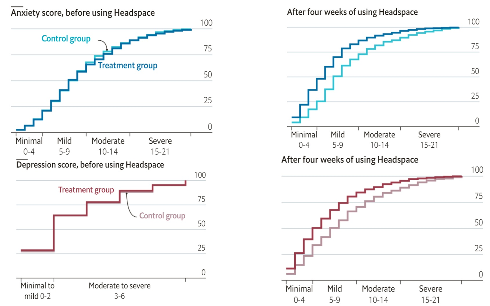

<style>
.column-left{
  float: left;
  width: 60%;
  text-align: left;
}
.column-right-small{
  float: right;
  width: 30%;
  text-align: right;
  padding-left: 10px;
  font-size:10px;
}

.column-right-large{
  float: right;
  width: 40%;
  text-align: left;
  padding-left: 10px;
}

.column-full{
  float: none;
  width: 100%;
  text-align: centre;
}


.column-full-left{
  float: none;
  width: 100%;
  text-align: left;
}

.center {
  height: 200px;
  border: 0px;
  text-align: center;
}


.RUsers {
  padding: 1em;
  background: aliceblue;
  color: black;
}


.SPSS {
  padding: 1em;
  background: whitesmoke;
  color: black;
}

</style>


<div class="column-right-large">

```{r setup, echo=FALSE, fig.align="right"}
knitr::include_graphics("images/unvotes.jpg")
knitr::opts_chunk$set(echo = TRUE, eval=FALSE)
library(tidyverse)
library(broom)
library(modelsummary)
library(kableExtra)
# library(lubridate)
# library(scales)
# library(DT)
# library(unvotes)

# United Nations
# bikes <- read_csv("data/unvotes.jpg")

```

</div>


## Introduction

How do various countries vote in the United Nations General Assembly, how have their voting patterns evolved throughout time, and how similarly or differently do they view certain issues? Answering these questions (at a high level) is the focus of this analysis.

### Packages

We will use the **tidyverse**, **lubridate**, and **scales** packages for data wrangling and visualization, and the **DT** package for interactive display of tabular output, and the **unvotes** package for the data.


### Data

The data we're using originally come from the **unvotes** package. In the chunk below we modify the data by joining the various data frames provided in the package to help you get started with the analysis.

```{r}
unvotes <- read.csv("data/unvotes.csv")
```

## UN voting patterns

Let's create a data visualisation that displays how the voting record of the UK & NI changed over time on a variety of issues, and compares it to two other countries: US and Turkey.

We can easily change which countries are being plotted by changing which countries the code above `filter`s for. Note that the country name should be spelled and capitalized exactly the same way as it appears in the data. 


```{r plot-yearly-yes-issuev1, fig.width=10, fig.height=6, message=FALSE}
unvotes %>%
  filter(country %in% c("United Kingdom", "United States", "Turkey")) %>%
  mutate(year = year(date)) %>%
  group_by(country, year, issue) %>%
  summarize(percent_yes = mean(vote == "yes")) %>%
  ggplot(mapping = aes(x = year, y = percent_yes, color = country)) +
  geom_point(alpha = 0.4) +
  geom_smooth(method = "loess", se = FALSE) +
  facet_wrap(~issue) +
  scale_y_continuous(labels = percent) +
  labs(
    title = "Percentage of 'Yes' votes in the UN General Assembly",
    subtitle = "1946 to 2019",
    y = "% Yes",
    x = "Year",
    color = "Country"
  )
```


```{r plot-yearly-yes-issuev2, fig.width=10, fig.height=6, message=FALSE}
unvotes %>%
  filter(country %in% c("United Kingdom", "United States", "Turkey")) %>%
  mutate(year = year(date)) %>%
  group_by(country, year, issue) %>%
  summarize(percent_yes = mean(vote == "yes")) %>%
  ggplot(mapping = aes(x = year, y = percent_yes, color = country)) +
  geom_point(alpha = 0.4) +
  geom_smooth(method = "loess", se = FALSE) +
  facet_wrap(~issue) +
  scale_y_continuous(labels = percent) +
  labs(
    title = "Percentage of 'Yes' votes in the UN General Assembly",
    subtitle = "1946 to 2019",
    y = "% Yes",
    x = "Year",
    color = "Country"
  )
```

## References

1.  David Robinson (2017). [unvotes](https://CRAN.R-project.org/package=unvotes): United Nations General Assembly Voting Data. R package version 0.2.0.
2.  Erik Voeten "Data and Analyses of Voting in the UN General Assembly" Routledge Handbook of International Organization, edited by Bob Reinalda (published May 27, 2013).
3.  Much of the analysis has been modeled on the examples presented in the [unvotes package vignette](https://cran.r-project.org/web/packages/unvotes/vignettes/unvotes.html).

## Appendix {#appendix}

Below is a list of countries in the dataset:

```{r list-countries, echo=FALSE}

unvotes %>% 
  select(country) %>%
  arrange(country) %>% 
  distinct() %>%
  datatable()

```

🧶 *Knit frequently, knit often. Look at your report, make sure it looks neat, professional and tidy.*


🧶 *Knit frequently, knit often. Look at your report, make sure it looks neat, professional and tidy.*

<br/>
<br/>
<br/>
<br/>
<br/>
<br/>
<br/>
<br/>


# Numeric literacy: Are meditation apps effective?

.Please study the graph below carefully, read the explanation and answer the questions below: 


<!-- <div class="column-full"> -->
<!-- </div> -->
```{r numeric-lit, echo=FALSE, fig.align="center", fig.cap="An app a day keeps the doctor away", out.width=800}

```
The [Source](https://economics.mit.edu/files/22355) of this study is: "Managing Emotions: The Effects of Online Mindfulness Meditation on Mental Health and Economic Behavior" by Advik Shreekumar and Pierre-Luc Vautrey, 2022


### Questions: 

1. What do you notice?
    
    After studying the graph and reading the text, what details do you see in the graph that are unusual or surprising? Looking at it carefully and paying attention to detail, what can you get out of the graph that is not necessarily obvious at first glance
    
2. What do you wonder? 
    
    Try to formulate a question, related to the graph, something that you would genuinely like to know. Please state your question clearly: as in a statement that ends with a question mark. 
    
3. How does this relate to you and your community?

    Think of something that makes this graph relate to you personally or to your community, however defined. Make sure that you *do not* talk about something that relates the graph to everyone, no matter who they are, but only to members of *your* community, something *specific* that does not related to other communities. This is your opportunity to be creative!  
    
4. What’s going on in this graph? Write a catchy headline that captures the graph’s main idea.


