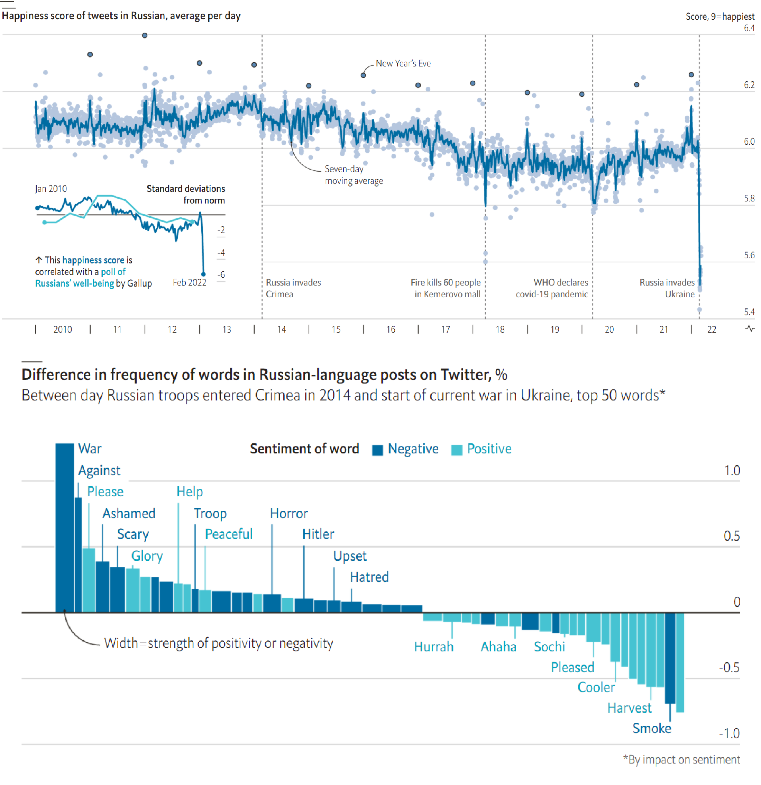

<style>
.column-left{
  float: left;
  width: 60%;
  text-align: left;
}
.column-right-small{
  float: right;
  width: 30%;
  text-align: right;
  padding-left: 10px;
  font-size:10px;
}

.column-right-large{
  float: right;
  width: 40%;
  text-align: left;
  padding-left: 10px;
}

.column-full{
  float: none;
  width: 100%;
  text-align: centre;
}


.column-full-left{
  float: none;
  width: 100%;
  text-align: left;
}

.center {
  height: 200px;
  border: 0px;
  text-align: center;
}


.RUsers {
  padding: 1em;
  background: aliceblue;
  color: black;
}


.SPSS {
  padding: 1em;
  background: whitesmoke;
  color: black;
}

</style>


```{r setup, echo=FALSE, message=FALSE, warning=FALSE}


knitr::opts_chunk$set(
	echo = FALSE,
	message = FALSE,
	warning = FALSE
)
library(tidyverse)
library(broom)
library(modelsummary)
library(gridExtra)
# library(lubridate)
# library(scales)
# library(DT)
# library(unvotes)

# United Nations


```


<div class="column-right-small">

```{r auction, echo=FALSE, fig.align="right"}
knitr::include_graphics("images/old-auction.png")
```

Pierre-Antoine de Machy, Public Sale at the Hôtel Bullion, Musée Carnavalet, Paris (18th century)
</div>


<div class="column-full-left">


In this lab, we will explore the printed catalogues of 28 auction sales in Paris, 1764 - 1780. Data curators Sandra van Ginhoven and Hilary Coe Cronheim (who were PhD students in the Duke Art, Law, and Markets Initiative at the time of putting together this dataset) translated and tabulated the catalogues of 3393 paintings, their prices, and descriptive details from sales catalogues over 60 variables.


As usual, you have the following resources available to you:

* Please submit your lab using [this link](https://docs.google.com/forms/d/e/1FAIpQLSfGNJs9jARHogiaPBG1699VnzeSOtS0K52XAOA3fHNFkB0-iQ/viewform).
* Would you like to use one of your tokens for an extension or an upgrade from $R \rightarrow M$ ? Please fill in [this form](https://bit.ly/3Lx6Xo4).
* If you have questions, please [book a slot](https://bit.ly/OferMeet) during Ofer's office hours!


### Exploratory Data Analysis (EDA)

You can find the dataset [here](https://bit.ly/36IfLaO), and the codebook [here](http://www2.stat.duke.edu/~cr173/Sta112_Fa16/data/paris_paintings.html). 


```{r load, echo=TRUE, message=FALSE, warning=FALSE}

# Load the dataset as follows. 
# This code will replace any 
# of the strings provided with a NA, 
# denoting unavailable data. 
paintings <- 
  read_csv("https://bit.ly/36IfLaO", 
  na = c("n/a", "", "NA"))

```

1. Choose one of the paintings in the dataset, and do some research about it. Show an image of the painting or its painter in your report. Summarize your research in a paragraph or two, giving details about its dimensions, price, and any other interesting features. Why did you choose this painting? 


2. Explore the data-set. In particular: 
    
    *   How many paintings are recorded in the dataset? How many variables are in the dataset?
    *   Show the distribution of the paintings' height, width and price. Because these are skewed, show these distributions on a normal scale and on a log-scale.  

```{r distributions}

p1 <- ggplot(paintings) + 
  geom_histogram(aes(x=price, y=..density..), binwidth = 500) + 
  labs(x="price (livres)")

p2 <- ggplot(paintings) + 
  geom_histogram(aes(x=Height_in, y=..density..), binwidth = 2) + 
  labs(x="height (inches)")

p3 <- ggplot(paintings) + 
  geom_histogram(aes(x=Width_in, y=..density..), binwidth = 1)+ 
  labs(x="width (inches)")

p1.log <- ggplot(paintings) + 
    geom_histogram(aes(x=price, y=..density..), binwidth = .1) + scale_x_log10()+ 
  labs(x="price (livres, log scale)")

p2.log <- ggplot(paintings) + 
  geom_histogram(aes(x=Height_in, y=..density..), binwidth = .05) + scale_x_log10()+ 
  labs(x="height (inches, log scale)")

p3.log <- ggplot(paintings) + 
  geom_histogram(aes(x=Width_in, y=..density..), binwidth = .05) + scale_x_log10() + 
  labs(x="width (inches, log scale)")

grid.arrange(p1, p2, p3, p1.log, p2.log, p3.log, nrow=2)


```


```{r distributions-show, eval=FALSE, echo=TRUE}

# Fill in the blanks
ggplot(____) + 
  geom_histogram(aes(x=____), binwidth = __)

# Fill in the blanks
ggplot(____) + 
    geom_histogram(aes(x=____), binwidth = __) + scale_x_log10()


```


</div>

<div class="column-right-small">

```{r scatter, echo=FALSE}

bks <- round(10^seq(.25, 4, by=.25))

paintings %>% 
       mutate(type = case_when( 
                Width_in == Height_in ~ "square",
                Width_in > Height_in ~ "landscape",
                TRUE ~ "portrait"), 
              shp = ifelse(landsALL==0,15L,16L)) %>% 
ggplot(aes(x = Width_in, y = Height_in, color=type, shape=factor(shp))) +
  geom_point(alpha=.4) +
  # geom_smooth(method = "lm") +
  geom_abline(slope=1, intercept=0, color="blue", 
              size=1, alpha=.5) +
  labs(
    title = "Height vs. width of paintings",
    subtitle = "Paris auctions, 1764 - 1780",
    x = "Width (inches)",
    y = "Height (inches)"
  ) + scale_x_log10(breaks=bks) + scale_y_log10(breaks=bks) + theme(legend.position = "none")


paintings <- paintings %>% 
  mutate(layout=ifelse(Width_in > Height_in, "portrait", "landscape"))


landscape_paintings <- paintings %>% 
  filter(layout == "landscape")

portrait_paintings <- paintings %>% 
  filter(layout == "portrait")

# This model will predict the painting's height 
landscape.mdl <- lm(Height_in ~ Width_in, data = landscape_paintings)
portrait.mdl  <- lm(Height_in ~ Width_in, data = portrait_paintings)

# Now display the estimated models (estimations = slope, intercept)
# Compare and interpret them

# modelsummary(list(landscape = landscape.mdl, 
#                   portrait  = portrait.mdl), 
#              stars=TRUE, 
#              gof_omit = "Lik|F")

landscape.mdl <- lm(log(Height_in) ~ log(Width_in), data = landscape_paintings)
portrait.mdl  <- lm(log(Height_in) ~ log(Width_in), data = portrait_paintings)

# Now display the estimated models (estimations = slope, intercept)
# Compare and interpret them

# modelsummary(list(landscape = landscape.mdl, 
#                   portrait  = portrait.mdl), 
#              stars=TRUE, 
#              gof_omit = "Lik|F")


```
</div>


<div class="column-full-left">


3. Show a scatter-plot of the height of a painting depending on the painting's width. Because of the skewness of the data, you would want to convert the axis using `scale_x_log10()` and  `scale_y_log10()`. You will see that the data-points arranged into two separate clusters. How do you explain this clustering? Add a straight diagonal line, starting at the origin and extending in 45 degrees. To do this, you will need to add the layer ` + geom_abline(slope=___, intercept=___)`. 

    * What does this straight line signify? 
    * What is the difference between the paintings above and those below the line?
    * What else do you notice, or wonder about the graph?
    * BONUS: Make the color of the dots above the line different to those underneath the straight line. Make the shape of each data point depend on whether the the painting's description mention any type of landscape (See `landsALL` in the [codebook](http://www2.stat.duke.edu/~cr173/Sta112_Fa16/data/paris_paintings.html)).


```{r layout-show, echo=TRUE, eval=FALSE}

# To add the column "layout" to our dataset, we use 
# the `mutate` function. The new column tells us whether 
# a painting has a layout of a "portrait" (height > width) or 
# "landscape" (width > height).
# 
# You can use the drop_na() function in order 
# to remove observations without values for 
# the height and the width.
# 

paintings <- paintings %>% 
  mutate(layout=ifelse(_____ > _____, "portrait", "landscape"))

ggplot(_____, aes(x = _____, y = _____, color = _____)) +
  geom_point() + 
  labs(
    title = "_____",
    subtitle = "_____",
    x = "_____",
    y = "_____"
  ) 


```


🧶 *Knit frequently, knit often. Look at your report, make sure it looks neat, professional and tidy.*

### Modelling

4. Now use the original `paintings` dataset to create two separate datasets: 

    * The `landscape_paintings`, includes only those paintings in which the width is greater than the height. You can use the `filter` function to create this dataset.   
        * The `portrait_paintings`, includes only those paintings in which the `width` is smaller than the `height`. You can use the `filter` function to create this dataset.
        
        * Now create one linear model for each of those datasets, predicting the painting's `height` from its `width`. Interpret the two models and Now and compare between them. How do the intercepts compare to one another? How do the two slopes compare to one another? How do you explain this difference?
          
        * Bonus: Instead a linear regression model to predict the painting's `height` from its `width`, create linear regressions predicting the `log(height)` from the `log(width)`. Compare to your results in the previous question. What did you find? 


```{r scatter-show, echo=TRUE, eval=FALSE}

# From the original dataset please create two new datasets. One including
# only the paintings with a portrail layout, the other including only 
# paintings with a landscape layout.


landscape_paintings <- paintings %>% 
  filter(layout == _____)

portrait_paintings <- _____ %>% 
  filter(_____ == _____)

# This model will predict the painting's height 
landscape.mdl <- lm(_____ ~ _____, data = _____)
portrait.mdl  <- lm(_____ ~ _____, data = _____)

# Now display the estimated models (estimations = slope, intercept)
# Compare and interpret them

modelsummary(list(landscape = landscape.mdl, 
                  portrait  = _____), 
             stars=_____, 
             gof_omit = "Lik|F|B")


```


5. Again, use the original `paintings` dataset to create two separate datasets. This time, choose two different painting categories. For example, you may want to compare the `Dutch` paintings to the `Italian` ones, or you want to compare the paintings made of wood to those made of cloth.

    * Explain how you decided to separate the two types of paintings, what criteria did you choose and why. 
    * Create two linear models, one for each of the two datasets, predicting the painting's `height` from its `width`. Now compare between the two intercepts and the two slopes. Interpret the results and explain what you found. 


🧶 *Knit frequently, knit often. Look at your report, make sure it looks neat, professional and tidy.*

<br/>
<br/>
<br/>
<br/>
<br/>
<br/>
<br/>
<br/>

</div>


# Numeric literacy: A house [divided](https://en.wikipedia.org/wiki/Lincoln%27s_House_Divided_Speech)?

Most data on the Russian home front are unreliable. The government has limited freedom of speech and arrested thousands of protesters. A few polls do show support for the war. But the reliability of such polls is moot. The Kremlin has criminalised statements about the war that it deems false. But they still reveal political cleavages and trends over time. One poll found that being young or female, living in a big city, having a degree and not watching tv predicted anti-war views. Support may also be waning. In surveys of internet users in Moscow run by [Alexei Navalny](https://en.wikipedia.org/wiki/Alexei_Navalny), an opposition leader, the share of people blaming Russia surged during the war’s first week.

Another rich source of data is social media. A team at the University of Vermont has built a measure of sentiment on these sites, using frequencies of various words and ratings of the joy or sadness they convey. Applied to Russian-language Twitter, it accurately detects happy moments like New Year’s Eve. And its fluctuations over time line up with those of a conventional poll run by Gallup, an American firm.

This measure finds that Mr Putin has sent Twitter users into deep despair. Mentions of “war”, frowned upon by the Kremlin, have risen sharply, as have “scary”, “ashamed” and “horror”. Overall, posters’ mood has worsened eight times more than at the start of the covid-19 pandemic. Based on past trends, this implies a one-point dip on Gallup’s one-to-ten happiness scale. 

Sources: The Economist, Computational Story Lab; [dorussianswantwar.com](https://www.dorussianswantwar.com/en); [hedonometer.org](hedonometer.org); Qualitas; Twitter; VTsIOM


Please study the graph below carefully, read the explanation and answer the questions below: 


<div class="column-full">

```{r numeric-lit, echo=FALSE, fig.align="center", fig.cap="", out.width=800}

```
*Above:* Happiness score of tweets in Russian, average per day. *Below:* Difference in frequency of words in Russian-language posts on Twitter, % Between day Russian troops entered Crimea in 2014 and start of current war in Ukraine, top 50 words
</div>


### Questions: 

1. What do you notice?
    
    After studying the graph and reading the text, what details do you see in the graph that are unusual or surprising? Looking at it carefully and paying attention to detail, what can you get out of the graph that is not necessarily obvious at first glance
    
2. What do you wonder? 
    
    Try to formulate a question, related to the graph, something that you would genuinely like to know. Please state your question clearly: as in a statement that ends with a question mark. 
    
3. How does this relate to you and your community?

    Think of something that makes this graph relate to you personally or to your community, however defined. Make sure that you *do not* talk about something that relates the graph to everyone, no matter who they are, but only to members of *your* community, something *specific* that does not related to other communities. This is your opportunity to be creative!  
    
4. What’s going on in this graph? Write a catchy headline that captures the graph’s main idea.


