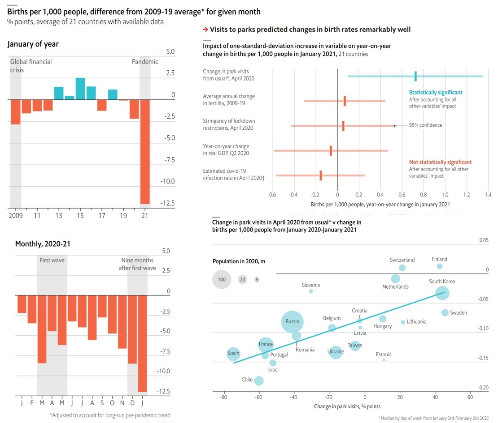

<style>
.column-left{
  float: left;
  width: 60%;
  text-align: left;
}
.column-right-small{
  float: right;
  width: 30%;
  text-align: right;
  padding-left: 10px;
  font-size:10px;
}

.column-right-large{
  float: right;
  width: 40%;
  text-align: left;
  padding-left: 10px;
}

.column-full{
  float: none;
  width: 100%;
  text-align: centre;
}


.column-full-left{
  float: none;
  width: 100%;
  text-align: left;
}

.center {
  height: 200px;
  border: 0px;
  text-align: center;
}


.RUsers {
  padding: 1em;
  background: aliceblue;
  color: black;
}


.SPSS {
  padding: 1em;
  background: whitesmoke;
  color: black;
}

</style>


```{r setup, echo=FALSE, message=FALSE, warning=FALSE}


knitr::opts_chunk$set(
	echo = FALSE,
	message = FALSE,
	warning = FALSE
)

library(tidymodels)
library(modelsummary)
library(gridExtra)
library(kableExtra)
library(tidyverse)
# library(knitr)
# library(openintro)
# library(scales)
# library(broom)
set.seed(1234)


```


<div class="column-right-large">

```{r auction, echo=FALSE, fig.align="right"}
knitr::include_graphics("images/smoking.jpg")
```

Maternal smoking during pregnancy could cause biological aging, influencing fetal growth
</div>


<div class="column-full-left">


As usual, you have the following resources available to you:

* Please submit your lab using [this link](https://docs.google.com/forms/d/e/1FAIpQLScG6JZ04OA1PGOc5aA0U0lrzk1gPGem4jixike1FOxpGAzgRA/viewform).
* Would you like to use one of your tokens for an extension or an upgrade from R (revise) to an M (meeting specs)? Please fill in [this form](https://bit.ly/3Lx6Xo4).
* If you have questions, please [book a slot](https://bit.ly/OferMeet) during Ofer's office hours!


### Data

In 2004, the state of North Carolina released to the public [a large data set]() containing information on births recorded in this state. This data set has been of interest to medical researchers who are studying the relation between habits and practices of expectant mothers and the birth of their children. This is a random sample of 1,000 cases from this data set, with 13 variables. This lab assignment is based on Wen et al (1995), and you can download the dataset using [this link](https://bit.ly/3IxUNbZ).


```{r}

tribble(
  ~name, ~description, 
  "fage", "Father's age in years", 
  "mage", "Mother's age in years.", 
  "mature", "Maturity status of mother.",
  "weeks", "Length of pregnancy in weeks.",
  "premie", "Whether the birth was classified as premature (premie) or full-term.",
  "visits", "Number of hospital visits during pregnancy.",
  "gained","Weight gained by mother during pregnancy in pounds",
  "weight", "Weight of the baby at birth in pounds.",
  "lowbirthweight", "Whether baby was classified as low birthweight `low` or not `not low`.",
  "gender", "Gender of the baby, `female` or `male.`",
  "habit", "Status of the mother as a `nonsmoker` or a `smoker`.",
  "marital", "Whether mother is `married` or `not married` at birth.",
  "whitemom", "Whether mom is `white` or `not white`"
) %>%  kbl() %>%
  kable_paper(full_width = F)

```


### Prepare 

In this lab we'll be generating random samples. This means that every time you sample, you will get different results. To avoid having the samples change every time you knit your document, you may set a seed. The seed guarantees that although the random sampling will repeat itself the same way, every time you run the code.


```{r show-setup, eval=FALSE, echo=TRUE}
# Confirm setting the appropriate code-chunk options to FALSE 
library(tidyverse)
library(tidymodels)
ncbirths <- read_csv("https://bit.ly/3IxUNbZ")
set.seed(____)

```


# Exercises

1.  The first step in the analysis of a new dataset is getting acquainted with the data. 
  
    * What do the cases (rows) in this data set signify? How many cases are there in our sample? How many variables?
    * Plot distribution for variables of interest for the rest of the lab. Pay attention to both categorical and numerical variables, and for numerical variables, report whether you see any outliers.  
    * Plot scatter-plots to show the relationships between variables of interest.

<br/>

::: { .RUsers }

A 1995 study (Wen et al 1995) suggests that average weight of Caucasian babies born in the US is 3,369 grams. To find whether the average weight of Caucasian babies has changed since then, we will make use of a dataset described above. In this dataset we only have information on mother's race, so we will make the simplifying assumption that babies of Caucasian mothers are also Caucasian, i.e. `whitemom = "white"`. 

Our null hypothesis will state that "there is nothing going on", i.e. no change since 1995: $H_0: \mu = 3,369~grams$.

Our alternative hypothesis should reflect the research question, i.e. some change since 1995. Since the research question doesn't state a direction for the change, we use a two sided alternative hypothesis: $H_A: \mu \ne 3,369~grams$.

:::

<br/>

2.  Create a filtered data frame called `ncbirths_white` that contain data only from white mothers, for whom the `habit` variable is not `na`. Then, calculate and *report* the mean of the baby weight in this data set.

3.  Run the appropriate hypothesis test, visualize the null distribution, calculate the p-value, and interpret the results in context of the data and the hypothesis test.

```{r read-stuff-noshow, echo=FALSE, eval=FALSE, include=FALSE}

# create filtered data 
ncbirths_white <- read_csv("https://bit.ly/3IxUNbZ") %>% 
  filter(whitemom=="white") 


mean.baby.weight <- mean(ncbirths_white$weight)

boot <- ncbirths_white %>%
  # specify the variable of interest
  specify(response = weight) %>% 
  # generate 10000 bootstrap samples
  generate(reps = 10000, type = "bootstrap") %>% 
  # calculate the mean of each bootstrap sample
  calculate(stat = "mean")

# 95th confidence interval: ranges from 2.5% to 97.5%
quantile(boot$stat, probs=c(0.025,0.975))

# calculate the p-value
mean(boot$stat >= 3369)

```


```{r read-stuff, echo=TRUE, eval=FALSE}

# create filtered data `ncbirths_white`
ncbirths_white <- read_csv("https://bit.ly/3IxUNbZ") %>% 
  filter(whitemom == ____) 


mean.baby.weight <- mean(____$____)

boot <- ____ %>%
  # specify the variable of interest
  specify(response = ____) %>% 
  # generate 10000 bootstrap samples
  generate(reps = ____, type = "bootstrap") %>% 
  # calculate the mean of each bootstrap sample
  calculate(stat = "mean")

# 95th confidence interval: ranges from 2.5% to 97.5%
quantile(____$____, probs=c(0.025,0.975))

# calculate the p-value
mean(____$____ >= ____)

```

<br/>

::: { .RUsers }

Let's discuss how this test would work. Our goal is to simulate a null distribution of sample means that is centred at the null value of 3369 grams. In order to do so, we need to carry out the following steps:

-   take a bootstrap sample of from the original sample,
-   calculate this bootstrap sample's mean,
-   repeat these two steps a large number of times to create a bootstrap distribution of means centred at the observed sample mean,
-   shift this distribution to be centred at the null value by subtracting / adding X to all bootstrap mean (X = difference between mean of bootstrap distribution and null value), and
-   calculate the p-value as the proportion of bootstrap samples that yielded a sample mean at least as extreme as the observed sample mean.

::: 

<br/>

### Baby weight vs. smoking

Consider the possible relationship between a mother's smoking habit and the weight of her baby.
Plotting the data is a useful first step because it helps us quickly visualize trends, identify strong associations, and develop research questions.

4.  Use the `ggplot` function to make a side-by-side boxplots displaying the relationship between `habit` and `weight`. What do you learn from the plot?

<br/>

::: { .RUsers }


Before moving forward, use the `drop_na()` to create a version of the dataset without observations where there are NAs for the variable `habit`. You can call this version `ncbirths_habitgiven`.

The box plots show how the medians and IQR of the two distributions compare, but we can also compare the means of the distributions using the following to first group the data by the `habit` variable, and then calculate the mean `weight` in these groups using.

```{r habit-means, eval=FALSE, echo=TRUE}

# create a data-frame where we drop all observations in which
# the variable `habit` has a missing value...
ncbirths_habitgiven <- 
  read_csv("https://bit.ly/3IxUNbZ") %>%
  drop_na(____)

ncbirths_habitgiven %>%
  group_by(habit) %>%
  summarise(mean_weight = mean(weight))
```

:::

<br/>

There is an observed difference, but is this difference statistically significant? In order to answer this question we will conduct a hypothesis test.

5.  Write the null hypothesis $H_0$ and the alternative hypothesis $H_a$ for testing if the average weights of babies born to smoking and non-smoking mothers are different.

6.  Create a bootstraps the appropriate hypothesis test. Then do the following: 

    - Show the distribution of the difference between the average weights of babies born to smoking and non-smoking mothers. 
    -   Construct a 95% confidence interval for the difference between the average weights of babies born to smoking and non-smoking mothers.
    -   Calculate the p-value for a difference in mean weight which is equal to zero
    -   Interpret the results in context of the data and the hypothesis test.


```{r difference-noshow, eval=FALSE, echo=FALSE}

boot <- ncbirths_habitgiven %>%
  # specify the variable of interest: 
  # we want to know how the weight
  # depends on the habit
  specify(weight ~ habit)  %>% 
  # now generate 10000 bootstraps
  generate(reps = 10000, type = "bootstrap") %>% 
  # for each bootstrap we calculate the difference in mean weight
  # subtracting the birthweight for babies of smoking mothers
  # from smoking mothers.
  calculate("diff in means", order = c("nonsmoker", "smoker"))
  
# Show the distribution of the difference in mean weights
ggplot(boot) + 
  geom_histogram(aes(stat), binwidth=5)

# 95% confidence interval
quantile(boot$stat, probs=c(.025, .975))

# p-value: what is the 
mean(boot$stat<0)

```


```{r difference-show, eval=FALSE, echo=TRUE}

boot <- ____ %>%
  # specify the variable of interest: 
  # we want to know how the weight
  # depends on the habit
  specify(weight ~ ____)  %>% 
  # now generate 10000 bootstraps
  generate(reps = ____, type = "bootstrap") %>% 
  # for each bootstrap we calculate the difference in mean weight
  # subtracting the birthweight for babies of smoking mothers
  # from non-smoking mothers.
  calculate("diff in means", order = c("nonsmoker", "____"))
  
# Show the distribution of the difference in mean weights
ggplot(____) + 
  geom_histogram(aes(____), binwidth=____)

# 95% confidence interval
quantile(____$____, probs=c(.025, ____))

# p-value: what is the 
mean(____$____ < 0)

```


<br/>

::: { .RUsers }

*Interpretation:* 

If the p-value is *less than 5%*, your interpretation would be as follows: "We have strong evidence for a significant difference in means between smoking and non-smoking mums at the 5% level"

If the p-value is *greater than 5%*, your interpretation would be as follows: "We *do not* have strong evidence for a significant difference in means between smoking and non-smoking mums at the 5% level"


:::


### Bonus questions: Baby weight vs. mother's age

In this portion of the analysis we focus on two variables. The first one is `maturemom`.

7. First, a non-inference task: Determine the age cutoff for younger and mature mothers. Use a method of your choice, and explain how your method works.

8. The other variable of interest is `lowbirthweight`. Conduct a hypothesis test evaluating whether the proportion of low birth weight babies is higher for mature mothers. State the hypotheses, verify the conditions, run the test and calculate the p-value, and state your conclusion in context of the research question. Use $\alpha = 0.05$. If you find a significant difference, construct a confidence interval, at the equivalent level to the hypothesis test, for the difference between the proportions of low birth weight babies between mature and younger mothers, and interpret this interval in context of the data.


🧶 *Knit frequently, knit often. Look at your report, make sure it looks neat, professional and tidy.*

<br/>

### Reference

Wen, Shi Wu, Michael S. Kramer, and Robert H. Usher. "Comparison of birth weight distributions between Chinese and Caucasian infants." American Journal of Epidemiology 141.12 (1995): 1177-1187, see [original article](https://academic.oup.com/aje/article-abstract/141/12/1177/148415?login=false).


<br/>
<br/>
<br/>
<br/>
<br/>
<br/>
<br/>

</div>


# Numeric literacy: Parks and procreation?

As lockdowns forced couples to “Netflix and chill” every night, it seemed plausible that covid-19 might lead to a baby boom. Instead, it has caused a bust. The 21 countries that have published data for January—the first full month in which babies conceived during the first wave were due—report, on average, 11% less births per 1,000 people than in January 2020, and 12% less than you would expect based on each country’s fertility trend in 2009-19. If this trend continues, the number of births prevented by the pandemic may exceed the death toll from covid-19.

Data are not yet available for poor countries, where most births occur. And rich-world fertility rates may rise soon, as pregnancies that began in the mid-2020 lull in covid-19 cases come to term. But it would take only a 7% drop in global fertility for a year—just over half the decline in the data from January—for the pandemic to have resulted in 10m fewer births. Such a reduction would equal our estimate of excess deaths caused by covid-19 (see Briefing).

There are lots of ways the pandemic could have cut fertility. Birth rates tend to track economic growth. Lockdowns have made dating difficult. And couples may have delayed having children to avoid hospitals or clinics that treat covid-19 patients.

Disentangling these factors’ impact is tricky. Some places, such as Chile and Israel, saw stark declines in fertility; others, like Switzerland and Finland, eked out gains. In general, the worse a country’s covid-19 infection rate was, the more its birth rate fell. The same was true of lockdown stringency and of economic contraction.

However, one measure tracked fertility unusually well: the change in attendance at parks in January-April 2020, as reported by Google. This link is hard to interpret. Rather than park traffic itself raising birth rates, something else must be influencing both park visits and conceptions. Yet once you account for footfall at parks, neither infection rates nor gdp nor other mobility data improve predictions significantly.


Sources: The Economist, Federal Reserve Bank of St Louis; Google; humanfertility.org; OECD; Our World in Data; Statista; Trading Economics; World Bank; national statistics; The Economist

This article appeared in the [Graphic detail section](https://www.economist.com/graphic-detail/2021/05/15/park-visits-predict-changes-in-birth-rates-during-the-pandemic).


Please study the graph below carefully, read the explanation and answer the questions below: 


<div class="column-full">

```{r numeric-lit, echo=FALSE, fig.align="center", fig.cap="", out.width=800}

```

</div>


### Questions: 

1. What do you notice?
    
    After studying the graph and reading the text, what details do you see in the graph that are unusual or surprising? Looking at it carefully and paying attention to detail, what can you get out of the graph that is not necessarily obvious at first glance
    
2. What do you wonder? 
    
    Try to formulate a question, related to the graph, something that you would genuinely like to know. Please state your question clearly: as in a statement that ends with a question mark. 
    
3. How does this relate to you and your community?

    Think of something that makes this graph relate to you personally or to your community, however defined. Make sure that you *do not* talk about something that relates the graph to everyone, no matter who they are, but only to members of *your* community, something *specific* that does not related to other communities. This is your opportunity to be creative!  
    
4. What’s going on in this graph? Write a catchy headline that captures the graph’s main idea.


