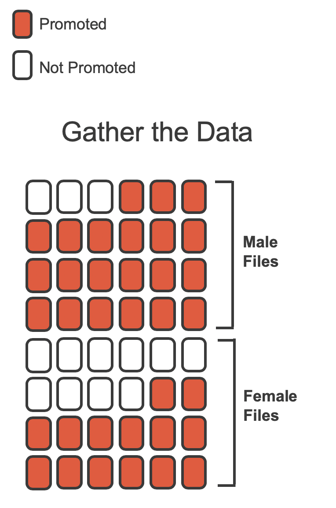

<style>
.column-left{
  float: left;
  width: 60%;
  text-align: left;
}
.column-right-small{
  float: right;
  width: 30%;
  text-align: left;
  padding-left: 10px;
  font-size:10px;
}

.column-right-large{
  float: right;
  width: 40%;
  text-align: left;
  padding-left: 10px;
}

.column-full{
  float: none;
  width: 100%;
  text-align: centre;
}


.column-full-left{
  float: none;
  width: 100%;
  text-align: left;
}

.center {
  height: 200px;
  border: 0px;
  text-align: center;
}


.RUsers {
  padding: 1em;
  background: aliceblue;
  color: black;
}


.SPSS {
  padding: 1em;
  background: whitesmoke;
  color: black;
}

</style>


```{r setup, echo=FALSE, message=FALSE, warning=FALSE}


knitr::opts_chunk$set(
	echo = FALSE,
	message = FALSE,
	warning = FALSE
)


library(tidymodels)
library(modelsummary)
library(gridExtra)
library(kableExtra)
library(tidyverse)
library(janitor)
# library(openintro)
# library(scales)
# library(broom)
set.seed(1234)


```

<div class="column-full-left">


As usual, you have the following resources available to you:

* Please submit your lab using [this link](https://docs.google.com/forms/d/e/1FAIpQLSeIeu39BhJKcz-xQABivTVvafsVYz-bRe5TOVyjv3DBTotn3w/viewform).
* Would you like to use one of your tokens for an extension or an upgrade from R (revise) to an M (meeting specs)? Please fill in [this form](https://bit.ly/3Lx6Xo4).
* If you have questions, please [book a slot](https://bit.ly/OferMeet) during Ofer's office hours!


## Sex discrimination case study 


<div class="column-right-large">

```{r genderpaygap, echo=FALSE, fig.align="right"}
knitr::include_graphics("images/genderpaygap.png")
```

Women get paid less than men. Can we use statistics to show that this is due to discrimination and not due to other factors? 
</div>
We consider a study investigating sex discrimination in the 1970s, which is set in the context of personnel decisions within a bank. The research question we hope to answer is, "Are individuals who identify as female discriminated against in promotion decisions made by their managers who identify as male?" 

::: {.SPSS}
The [`sex_discrimination`](http://openintrostat.github.io/openintro/reference/sex_discrimination.html) data set can be found in the [**openintro**](http://openintrostat.github.io/openintro) R package.  The data is based on Rosen B and Jerdee T. (1974). "Influence of sex role stereotypes on personnel decisions". *Journal of Applied Psychology* 59(1):9-14.

To load the data, please install the package `openintro`, and then assign the dataset to the variable `promo` like so:

```{r read-data, eval=TRUE, echo=TRUE}
promo <- openintro::sex_discrimination
```

:::

This study considered sex roles, and only allowed for options of "male" and "female". Note that the identities being considered are not gender identities and that the study allowed only for a binary classification of sex.


```{r boot, eval=FALSE, include=FALSE, echo=FALSE}

promo %>% tabyl(sex, decision) %>% 
  adorn_percentages() %>% 
  adorn_pct_formatting()  %>% adorn_title()
  

boot <- openintro::sex_discrimination %>% 
  specify(decision~sex, 
          success="promoted", 
          order = c("male", "female")) %>% 
  # generate 10000 bootstrap samples
  generate(reps = 10000, type = "bootstrap") %>% 
  # calculate the proportion of each bootstrap sample 
  calculate(stat="diff in props") 

ggplot(promo) + 
  geom_histogram(aes(x=stat, y=..density..),binwidth=0.03) 

mean(df$stat<=0.0)
quantile(df$stat,probs=c(.025, .975))

```


### Observed data

The participants in this study were 48 bank supervisors who identified as male, attending a management institute at the [University of North Carolina](https://www.unc.edu/) in 1972. They were asked to assume the role of the personnel director of a bank and were given a personnel file to judge whether the person should be promoted to a branch manager position.
The files given to the participants were identical, except that half of them indicated the candidate identified as male and the other half indicated the candidate identified as female.

These files were randomly assigned to the subjects. For each supervisor both the sex associated with the assigned file and the promotion decision were recorded. Using the results of the study, we would like to evaluate if individuals who identify as female are unfairly discriminated against in promotion decisions.

In this study, a smaller proportion of female identifying applications were promoted than males, but it is unclear whether the difference provides *convincing evidence* that individuals who identify as female are unfairly discriminated against. 


<div class="column-right-small">


```{r sex-rand-obs, out.width = "80%", fig.cap = "The sex discrimination study can be thought of as 48 red and white cards.", fig.alt = "48 cards are laid out; 24 indicating male files, 24 indicated female files.  Of the 24 male files 3 of the cards are colored white, and 21 of the cards are colored red. Of the female files, 10 of the cards are colored white, and 14 of the cards are colored red."}

```
</div>

The data are visualized as a set of cards. Note that each card denotes a personnel file (an observation from our dataset) and the colors indicate the decision: red for promoted and white for not promoted.
Additionally, the observations are broken up into groups of male and female identifying groups.


\vspace{-2mm}

-   $H_0:$ **Null hypothesis**.
    The variables `sex` and `decision` are independent. There is no real association between the two, and the observed difference between the proportion of males and females promoted, is just a coincidence. If we ran the experiment again with another 48 male bank supervisors, the results could be completely different.
-   $H_A:$ **Alternative hypothesis**.
    The variables `sex` and `decision` are *not* independent.
    The difference in promotion rates was not due to pure coincidence, and equally qualified female personnel are less likely to be promoted than male personnel.


::: {.SPSS}
**Hypothesis testing.**

These hypotheses are part of what is called a **hypothesis test**.
A hypothesis test is a statistical technique used to evaluate competing claims using data.
Often times, the null hypothesis takes a stance of *no difference* or *no effect*.
This hypothesis assumes that any differences seen are due to the variability inherent in the population and could have occurred by random chance.

If the null hypothesis and the data notably disagree, then we will reject the null hypothesis in favor of the alternative hypothesis.
:::

We will choose between the two competing claims by assessing if the data conflict so much with $H_0$ that the null hypothesis cannot be deemed reasonable.
If data and the null claim seem to be at odds with one another, and the data seem to support $H_A,$ then we will reject the notion of independence and conclude that the data provide evidence of discrimination.

1. Is this an [observational study or an experiment](https://www.youtube.com/watch?v=Z_OJzgkKe2A)? How does the type of study impact what can be inferred from the results? Please justify your answer. 

2. Create a contingency table, showing the percent of male and female candidates and promoted and not promoted. What is the difference in the proportion of males promoted and the proportion of females promoted? To find out, you would need to install the package `janitor` and to load it using the function `library(janitor)`. Then, run the following commands: 

```{r, echo=FALSE, include=FALSE, eval=FALSE}

promo %>% tabyl(sex, decision)

promo %>% tabyl(sex, decision) %>% 
  adorn_percentages() %>% 
  adorn_pct_formatting()  %>% adorn_title()
  
```


```{r show-contingency, echo=TRUE, eval=FALSE}

# use the name of the two variables and put them 
# within the tabyl(____, ____) function. 
# Make sure you have one row for males and one for females.
promo %>% tabyl(____, ____) 

# Do the same thing, but this time show the percentages. 
# Make sure that the table shows the percentage 
# of males and females promoted. The percentage of 
# promoted and non-promoted should add up to 100%
# for males and for females. 
promo %>% tabyl(____, ____) %>% 
  adorn_percentages() %>% 
  adorn_pct_formatting()  


```


\vspace{-2mm}

### Variability of the statistic


<div class="column-right-large">


```{r sex-rand-shuffle-1, out.width = "80%", fig.cap = "The sex discrimination data is shuffled and reallocated to new groups of male and female files.", fig.alt = "The 48 red and white cards which denote the original data are shuffled and reassigned, 24 to each group indicating 24 male files and 24 female files."}
knitr::include_graphics("images/sex-rand-02-shuffle-1.png")
```

</div>


The contingency table shows the proportion of bank supervisors who recommended promotion and those who did not. Now, suppose the bankers' decisions were independent of the sex of the candidate.
Then, if we conducted the experiment again with a different random assignment of sex to the files, differences in promotion rates would be based only on random fluctuation in promotion decisions.
We can actually perform this **randomization**, which simulates what would have happened if the bankers' decisions had been independent of `sex` but we had distributed the file sexes differently.

The test procedure we employ in this section is sometimes referred to as a **permutation test**. In the **simulation**, we thoroughly shuffle the 48 personnel files, 35 labelled `promoted` and 13 labelled `not promoted`, together and we deal files into two new stacks.
Note that by keeping 35 promoted and 13 not promoted, we are assuming that 35 of the bank managers would have promoted the individual whose content is contained in the file **independent** of the sex indicated on their file.
We will deal 24 files into the first stack, which will represent the 24 "female" files. The second stack will also have 24 files, and it will represent the 24 "male" files. The figure highlights both the shuffle and the reallocation to the sham sex groups.

Then, as we did with the original data, we tabulate the results and determine the fraction of personnel files designated as "male" and "female" who were promoted.

Since the randomization of files in this simulation is independent of the promotion decisions, any difference in promotion rates is due to chance.

3. Use the code below to generate one permutation of the data. Then create a contingency table of that permutation, and compare your results to the previous contingency table you made above. 
-    Are the total number of males and females the same as before? What about the total number of promoted and non-promoted? 
-    How do the proportions of promotions compare?
-    How does the difference in the proportion of promotions compare? 


```{r show-one-perm, echo=TRUE, eval=FALSE}

# Create one permuatation - start by setting a seed.
set.seed(___)
# Assume that the decision to promote is independent of 
# the sexual identity of the candidate 
permute1 <- promo %>%
  specify(decision ~ sex, success = "promoted") %>%
  hypothesize(null = "independence") %>%
  generate(reps = 1, type = "permute")  

# Show the permutations generated
permute1 %>% tabyl(___, ___)

# And now with percentages...
permute1 %>% tabyl(____, ____) %>% 
  adorn____() %>% 
  adorn____()  

```

```{r no-show-one-perm, echo=FALSE, eval=FALSE}
set.seed(35)
promo  %>% 
  tabyl(sex, decision)

promo  %>% 
  tabyl(sex, decision) %>% 
  adorn_percentages() %>% 
  adorn_pct_formatting()  

promo %>%
  specify(decision ~ sex, success = "promoted") %>%
  hypothesize(null = "independence") %>%
  generate(reps = 1, type = "permute")  %>% 
  tabyl(sex, decision) %>% 
  adorn_percentages() %>% 
  adorn_pct_formatting()  

set.seed(35)
permute1000 <-  promo %>%
  specify(decision ~ sex, success = "promoted") %>%
  hypothesize(null = "independence") %>%
  generate(reps = 1000, type = "permute") %>%
  calculate(stat = "diff in props", order = c("male", "female")) 

ggplot(permute1000) + geom_histogram(aes(x=stat, y=..density..), binwidth=1/12) + scale_x_continuous(breaks=seq(-.5,.5, by=.1)) 

p.value <- mean(permute1000$stat > .875-.583)


```


4. Finally, run the code below to simulate 1000 permutations of the data, permutations we would expect assuming that the null hypothesis was true. 
-    Assuming independence, what is the 95% confidence interval of the distribution of differences in proportion? 
-    Assuming independence, is the p-value of observing a difference in proportions as extreme as the one observed in our data? 
-    Does our data support our hypothesis $H_0$? Why or why not?


```{r show-thousand-perm, echo=TRUE, eval=FALSE}

# Create 1000 permutations, assuming that
# Start by setting a seed.
set.seed(___)
# Assume that the decision to promote is independent of 
# the sexual identity of the candidate 
permute1000 <-  promo %>%
  specify(decision ~ sex, success = "promoted") %>%
  hypothesize(null = "independence") %>%
  generate(reps = ___, type = "permute") %>%
  calculate(stat = "diff in props", order = c("male", "female")) 

# Create a histogram of the proportions, assuming 
ggplot(permute1000) + geom_____()

# Now find the 95% confidence interval 
quantile(permute1000, probs=c(___,___))

# Calculate the p-value, i.e. the probability that, given 
# the independence assumption (promotion vs sex) we 
# will observe a difference in proportion as extreme 
# as the one observed in our dataset
p.value <- mean(___$___ > ___)

```

</div>


<br/>
<br/>
<br/>
<br/>


<div class="column-full-left">


# Numeric literacy: [A rising tide lifts all boats](https://en.wikipedia.org/wiki/A_rising_tide_lifts_all_boats)?

Poor students in rich countries and rich students in poor ones. Who has better math scores?

There are some things money can’t buy. Education, however, does not appear to be among them—at least as measured by performance on international exams. On average, the poorest pupils in wealthy countries obtain vastly higher test scores than the richest in developing ones. In turn, strong students tend to become productive workers, making the mostly rich economies richer still. 

The exact mechanism by which knowledge is bought remains unclear. Do students in the rich world fare better because their governments provide superior schools? Or is the reason that they tend to have richer parents, and enjoy more educational resources at home? A new working paper by Dev Patel of Harvard University and Justin Sandefur of the Centre for Global Development, a think-tank, offers strong evidence that the wealth of a country affects exam results just as much as the wealth of a pupil’s household does.

Evaluating test scores around the world is harder than it sounds. Although pupils in the rich world mostly take one of a few big international exams, many developing countries rely on regional tests. This precludes apples-to-apples comparisons.

Please study the graph below carefully, read the explanation and answer the questions below: 


<div class="column-full">

```{r numeric-lit, echo=FALSE, fig.align="center", fig.cap="", out.width=800}
knitr::include_graphics("images/mathincome.png")
```

</div>

Sources: The Economist, Sources: "A Rosetta Stone for Human Capital", by D. Patel and J. Sandefur; World Bank; The Economist

This article appeared in the [Graphic detail section](https://www.economist.com/graphic-detail/2020/10/03/its-better-to-be-a-poor-pupil-in-a-rich-country-than-the-reverse) section of the print edition under the headline "A rising tide".


### Questions: 

1. What do you notice? In your answer, please refer to *all* three graphs.
    
    After studying ALL THREE graphs and reading the text, what details do you see in the graph that are unusual or surprising? Looking at it carefully and paying attention to detail, what can you get out of the graph that is not necessarily obvious at first glance. 
    
2. What do you wonder? 
    
    Try to formulate a question, related to the graph, something that you would genuinely like to know. Please state your question clearly: as in a statement that ends with a question mark. 
    
3. How does this relate to you and your community?

    Think of something that makes this graph relate to you personally or to your community, however defined (nationality, age, origin, gender, etc..). Make sure that you *do not* describe  something that relates to everyone, no matter who they are, but only to members of *your* community. You are looking for something *specific* that does not relate to other communities. This is your opportunity to be creative!  
    
4. What’s going on in this graph? Write a catchy headline that captures the graph’s main idea.
</div>


