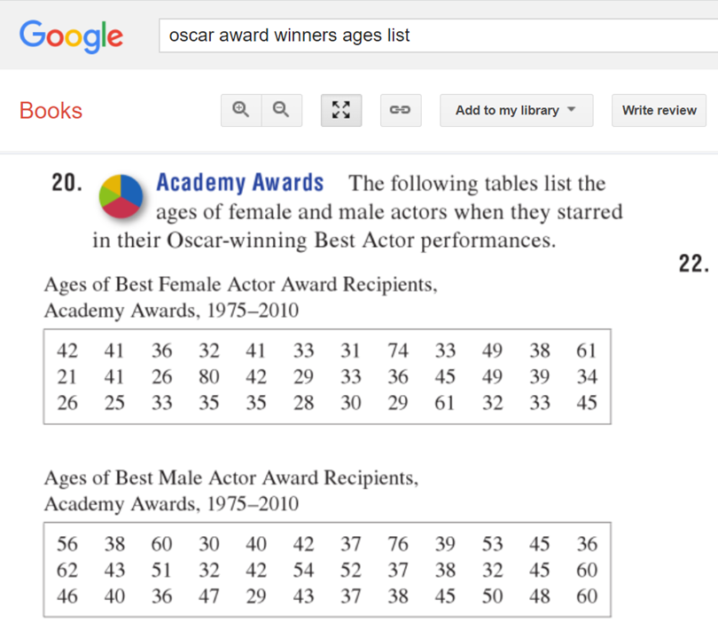

# oscar awards list ages
# https://oferengel.github.io/SO/Lab01.html

```{r setup, echo=FALSE}
knitr::opts_chunk$set(warning = FALSE, message = FALSE)
library(tidyverse)
library(kableExtra)

```


# Exercise 1: Introducing myself

1 Picture and stuff

2 Statistics and me


3. Use nested lists, and a link... 


# Exercise 2: Manually presenting tables with data

1. here is a table with data I found somewhere (where?)
2. here is a scatter plot with the data 

# Exercise 3: using mathematical notation in RMarkdown

1 let's look for example at a geometric sequence like this 
2 The formula for the sum of the terms would then be...
3 Let's apply the formula to a concrete case...

If we add up all the numbers we get... 
If we use the formula we get ...


So let's say $q = 0.75$ and we have 

$$ 0.75^0 + 0.75 + 0.75^2 + .... + 0.75^{100} = S_{100} = \frac{0.75^{100}-1}{0.75-1} $$
So if we add them all up $0.75^0 + 0.75 + .. + 0.75^{100}$, we get `r sum(0.75^(0:100))`. 
Another way, is to use the formula: $\frac{0.75^{100}-1}{0.75-1}$ 
The result will be `r (0.75^100-1)/(0.75-1)`. 
We can see that whether we sum up the numbers or use the formula, we get the same result. 
Hooray!


#########################

1 Take a picture of yourself, your cat or something else that is personal to you. 
And explain what it is about: 
ANSWER HERE: 


2 Write a little introduction about your relationship with statistics and
sustainable organisations. Do you have any background in statistics? How would
learning statistics benefit you in the future?
ANSWER HERE: 

3. Use nested lists... 

3 For example, what are the things you are looking forward to? (add links, emphasis)
* A link to web-pages about anything you feel could be relevant
* Doing cool stuff with fonts, such as Using italic font to emphasize really important ideas!
Using bold fonts.
* A link to a video...!


# Exercise 2: Manually presenting tables with data

Here is a table - oh now we need some code... 

I found the data here... 




```{r my-table, echo=FALSE}

data.oscars <- tribble(
  ~age, ~year, ~sex,
  42, 1975, "female",
  41, 1976, "female",
  25, 1975, "male",
  38, 1976, "male")


kable_classic(kbl(data.oscars), full_width = FALSE,position="left")

qplot(x=year, y=age, data=data.oscars)


data <- tribble(
  ~age, ~year, ~sex,
  42, 1975, "female",
  41, 1976, "female",
  36, 1977, "female",
  32, 1978, "female",
  41, 1979, "female",
  33, 1980, "female",
  31, 1981, "female",
  74, 1982, "female",
  33, 1983, "female",
  49, 1984, "female",
  38, 1985, "female",
  61, 1986, "female",
  21, 1987, "female",
  41, 1988, "female",
  26, 1989, "female",
  80, 1990, "female",
  42, 1991, "female",
  29, 1992, "female",
  33, 1993, "female",
  36, 1994, "female",
  45, 1995, "female",
  49, 1996, "female",
  39, 1997, "female",
  34, 1998, "female",
  26, 1999, "female",
  25, 2000, "female",
  33, 2001, "female",
  35, 2002, "female",
  35, 2003, "female",
  28, 2004, "female",
  39, 2005, "female",
  29, 2006, "female",
  61, 2007, "female",
  32, 2008, "female",
  33, 2009, "female",
  45, 2010, "female",
  56, 1975, "male",
  38, 1976, "male",
  60, 1977, "male",
  30, 1978, "male",
  40, 1979, "male",
  42, 1980, "male",
  37, 1981, "male",
  76, 1982, "male",
  39, 1983, "male",
  53, 1984, "male",
  45, 1985, "male",
  36, 1986, "male",
  62, 1987, "male",
  43, 1988, "male",
  51, 1989, "male",
  32, 1990, "male",
  42, 1991, "male",
  54, 1992, "male",
  52, 1993, "male",
  37, 1994, "male",
  38, 1995, "male",
  32, 1996, "male",
  45, 1997, "male",
  60, 1998, "male",
  46, 1999, "male",
  40, 2000, "male",
  36, 2001, "male",
  47, 2002, "male",
  29, 2003, "male",
  43, 2004, "male",
  37, 2005, "male",
  38, 2006, "male",
  45, 2007, "male",
  50, 2008, "male",
  48, 2009, "male",
  60, 2010, "male"
) 


qplot(x=year, y=age, color=sex ,data=data) + geom_smooth(se=0)


```


# Exercise 3: using mathematical notation in RMarkdown

Ok let's look for example at a geometric sequence. 
So we all know that if we have a geometric sequence like so:

$$ 1, q, q^2, q^3.... q^{100}  $$
The sum of the terms would then be...

$$ 1 + q + q^2 + q^3 +.... + q^{100} = S_{100} = \frac{q^{100}-1}{q-1} $$
So let's say $q = 0.75$ and we have 

$$ 0.75^0 + 0.75 + 0.75^2 + .... + 0.75^{100} = S_{100} = \frac{0.75^{100}-1}{0.75-1} $$
So if we add them all up $0.75^0 + 0.75 + .. + 0.75^{100}$, we get `r sum(0.75^(0:100))`. 
Another way, is to use the formula: $\frac{0.75^{100}-1}{0.75-1}$ 
The result will be `r (0.75^100-1)/(0.75-1)`. 
We can see that whether we sum up the numbers or use the formula, we get the same result. 
Hooray!
