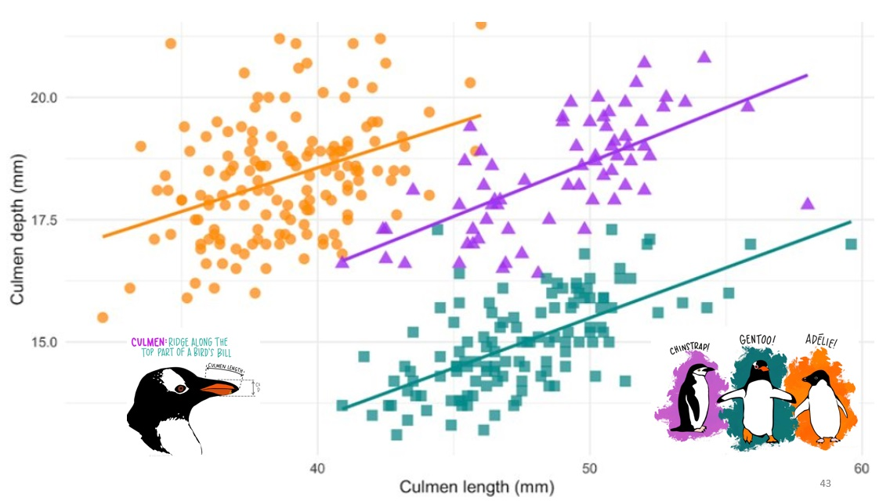

<style>
.column-left{
  float: left;
  width: 60%;
  text-align: left;
}
.column-right{
  float: right;
  width: 40%;
  text-align: right;
  padding-left: 10px;
}

.column-full{
  float: none;
  width: 100%;
  text-align: left;
}


.column-right-text-left{
  float: right;
  width: 40%;
  text-align: left;
  font-size: 10px;
}


.column-right-text-center{
  float: right;
  width: 40%;
  text-align: center;
  font-size: 16px;
}

.RUsers {
  padding: 1em;
  background: aliceblue;
  color: black;
}


.SPSS {
  padding: 1em;
  background: whitesmoke;
  color: black;
}

</style>

```{r setup, include=FALSE}
knitr::opts_chunk$set(echo = F)
library(knitr)
```


<div class="column-right-text-center">

```{r course-structure, fig.width=4}

```

$\mathbb{S}$ stands for STATISTICS

</div>


<div class="column-left">

Practical knowledge of statistics is a fundamental skill for researchers in all scientific disciplines. The recent growth of Big Data Applications and Data Science only enhances the need for students to have solid theoretical knowledge of statistical analysis to help them understand their own data as well as the analyses performed by others.

</div>


<div class="column-full">

The aim of Statistics I is to engage you with the fundamental concepts of statistical analysis and basic tools in statistical analysis using descriptive and univariate analysis, and research data management. Starting with the theoretical background of statistics, students are taught to engage critically with data-set characteristics; samples and populations, sampling strategies, and correlations. Subsequently, characteristics of the data in the data-set are discussed, dealing with measurement levels, central tendency, dispersion, distributions, and generalisations using the central limit theorem. The final part of the course focuses on statistical inference using techniques such as: t-test, proportion test, and an introduction to linear regression.

### Aim: 

Upon the successful completion of this course, I hope you will be able to achieve three things:

1. You will have been exposed to a wide range of methods of causal analysis, and acquire familiarity with their pros and cons. 

2. You will become more familiar with the terminology that is used in contemporary social research regarding causal inference.
 
3. You will be able to identify weaknesses of research making claims about causal mechanisms; recognize implicit assumptions that drive those claims and critique those assumptions and their limitations. 


### Method

The course is designed to follow the flipped-classroom approach. Readings and videos of the lectures are available before the course begins. You will be expected to read the relevant chapters in the textbook, watch the videos, and comment on them in Perusall PRIOR to attending the course. 
During the course itself, you will work on quizzes and lab assignments, which you may then submit at the end of each day. 
</div>


<div class="column-left">

#### Prepare

To prepare for the course, please complete the preparation assignments, all available on the Perusall platform. You can find the assignments in Nestor under `Assignments`.  You then need to click on the title of the item: `CLICK ME to access Perusall`. 

Completing the assignment involves watching the video and reading the text before the assigned deadlines. 

</div>


<div class="column-right">
```{r perusall, fig.width=4}

include_graphics("images/Perusall.jpg")

```
</div>


### Resources

Online (Nestor, Perusall, github): lectures, presentations, data-sets and exercises and background literature

To brush up on your R programming skills, there are a variety of free resources you can use, such as the [SICSS bootcamp](https://sicss.io/boot_camp/), Harvard’s famous [R Basics course](https://www.edx.org/course/data-science-r-basics), or Stanford’s [R Programming fundamentals](https://www.edx.org/course/r-programming-fundamentals). If you speak German, [this site](https://shiny.lmes.uni-potsdam.de/startR/) is quite nice. 

An introduction to visualization using `ggplot` is available in [this playlist](https://bit.ly/3rrzzqV).

For RMarkdown, have a look at [piping hot data](https://www.pipinghotdata.com/posts/2020-09-07-introducing-the-rstudio-ide-and-r-markdown/)

You may work and submit your assignments using any  statistical software including SPSS, STATA, Python, SCALA or Julia. However, as R is becoming the lingua franca of data science in many academic circles, this is going to be the default technology used in this course. 


```{r penguins, fig.width=4}

# include_graphics("images/course-structure.jpg")


```


